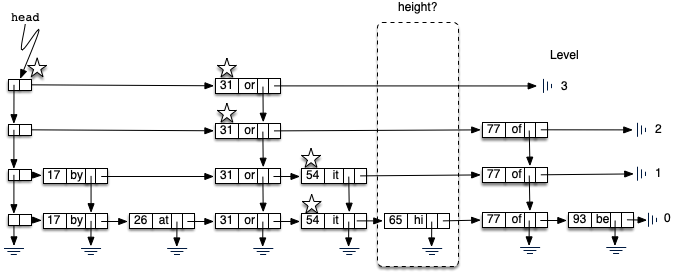

Dictionaries Revisited: Skip Lists
==================================

One of the most versatile collections available in Python is the
**dictionary**. Dictionaries, often referred to as **maps**, store a
collection of key-value pairs. The key, which must be unique, is
assigned an association with a particular data value. Given a key, it is
possible to ask the map for the corresponding associated data value.
The abilities to put a key-value pair into the map and then look up a
data value associated with a given key are the fundamental operations
that all maps must provide.

For example, Figure `1 <#fig_mappic>`__ shows a map containing key-value
pairs. In this case, the keys are integers and the values are small,
two-character words. From a logical perspective, there is no inherent
order or organization within the pairs themselves. However, as the
example shows, if a key (93) is provided to the map, the associated
value (be) is returned.

.. figure:: Figures/mappic.png
   :alt: An Example Map
   :name: fig_mappic
   :height: 1.5in

   An Example Map

The Map Abstract Data Type
--------------------------

The map abstract data type is defined by the following structure and
operations. The structure of a map, as described above, is a collection
of key-value pairs where values can be accessed via their associated
key. The map operations are given below:

-  ``Map()`` creates a new map that is empty. It needs no parameters and
   returns an empty map.

-  ``put(key,value)`` adds a new key-value pair to the map. It needs the
   key and the associated value and returns nothing. Assume the key is
   not already in the map.

-  ``get(key)`` searches for the key in the map and returns the
   associated value. It needs the key and returns a value.

It should be noted that there are a number of other possible operations
that we could add to the map abstract data type. We will explore these
in the exercises.

Implementing a Dictionary in Python
-----------------------------------

We have already seen a number of interesting ways to implement the map
idea. In Chapter `[sorting-and-searching] <#sorting-and-searching>`__ we
considered the hash table as a means of providing map behavior. Given a
set of keys and a hash function, we could place the keys in a collection
that allowed us to search and retrieve the associated data value. Our
analysis showed that this technique could potentially yield an
:math:`O(1)` search. However, performance degraded due to issues such as
table size, collisions, and collision resolution strategy.

In Chapter `[trees] <#trees>`__ we considered a binary search tree as a
way to store such a collection. In this case the keys were placed in the
tree such that searching could be done in :math:`O(\log n)`. However,
this was only true if the tree was balanced; that is, the left and the
right subtrees were all of similar size. Unfortunately, depending on the
order of insertion, the keys could end up being skewed to the right or
to the left. In this case the search again degrades.

The problem we would like to address here is to come up with an
implementation that has the advantages of an efficient search without
the drawbacks described above. One such possibility is called a **skip
list**. Figure `2 <#fig_initskiplist>`__ shows a possible skip list for
the collection of key-value pairs shown in Figure `1 <#fig_mappic>`__ (the reason for saying
“possible” will become apparent later). As you can see, a skip list is
basically a two-dimensional linked list where the links all go forward
(to the right) or down. The *head* of the list can be seen in the
upper left corner. Note that this is the only entry point into the skip
list structure.

.. figure:: Figures/initskiplist.png
   :alt: An Example Skip List
   :name: fig_initskiplist
   :width: 5in

   An Example Skip List

Before moving on to the details of skip-list processing it will be
useful to explain some vocabulary. Figure `3 <#fig_vocab1>`__ shows that
the majority of the skip list structure consists of a collection of data
nodes, each of which holds a key and an associated value. In addition,
there are two references from each data node.
Figure `4 <#fig_skipdatanode>`__ shows a detailed view of a single data
node.

.. figure:: Figures/vocabskiplist1.png
   :alt: The Body of the Skip List Is Made Up of Data Nodes
   :name: fig_vocab1
   :width: 5in

   The Body of the Skip List Is Made Up of Data Nodes

.. figure:: Figures/datanode.png
   :alt: A Single Data Node
   :name: fig_skipdatanode
   :height: 0.75in

   A Single Data Node

Figure `5 <#fig_vocab2>`__ shows two different vertical columns. The
leftmost column consists of a linked list of header nodes. Each header
node holds two references called ``down`` and ``next``. The ``next``
reference refers to a linked list of data nodes. The ``down`` reference
refers to the next lower header node. A detailed view of a header node
can be seen in Figure `6 <#fig_headernode>`__.

.. figure:: Figures/vocabskiplist2.png
   :alt: Header Nodes and Towers
   :name: fig_vocab2
   :width: 5in

   Header Nodes and Towers

.. figure:: Figures/headernode.png
   :alt: Each Header Node Holds Two References
   :name: fig_headernode
   :height: 0.75in

   Each Header Node Holds Two References

The columns of data nodes are known as **towers**. Towers are linked
together by the ``down`` reference in the data node. We can see that
each tower corresponds to a particular key-value pair, and towers can
have different heights. We will explain how the height of the tower is
determined later when we consider how to add data to the skip list.

Finally, Figure `7 <#fig_vocab3>`__ shows a horizontal collection of
nodes. If you look closely, you will notice that each level is actually
an ordered linked list of data nodes where the order is maintained by
the key. Each linked list is given a name, commonly referred to as its
**level**. Levels are named starting with 0 at the lowest row. Level 0
consists of the entire collection of nodes. Every key-value pair must be
present in the level-0 linked list. However, as we move up to higher
levels, we see that the number of nodes decreases. This is one of the
important characteristics of a skip list and will lead to an efficient
search. Again, it can be seen that the number of nodes at each level is
directly related to the height of the towers.

.. figure:: Figures/vocabskiplist3.png
   :alt: Each Horizontal Group of Data Nodes Is a Level
   :name: fig_vocab3
   :width: 5in

   Each Horizontal Group of Data Nodes Is a Level

Classes for the two types of nodes described above can easily be
constructed in the same fashion as for simple linked lists in the
previous section. A header node consists of two references,
``next`` and ``down``, both of which are initialized to ``None`` in the
constructor (see
Listing `[lst_headnode] <#lst_headnode>`__).

::

   class HeaderNode:
       def __init__(self):
           self._next = None
           self._down = None

       @property
       def next(self):
           return self._next

       @next.setter
       def next(self, value):
           self._next = value

       @property
       def down(self):
           return self._down

       @down.setter
       def down(self, value):
           self._down = value

A data node has four fields: two for the
key and value, and two additional for the references ``next`` and
``down``. Again, the references are initialized to ``None`` and wrapped
into ``properties`` for data manipulation (see Listing `[lst_datanode] <#lst_datanode>`__).

::

   class DataNode:
       def __init__(self, key, value):
           self._key = key
           self._data = value
           self._next = None
           self._down = None

       @property
       def key(self):
           return self._key

       @property
       def data(self):
           return self._data

       @data.setter
       def data(self, value):
           self._data = value

       @property
       def next(self):
           return self._next

       @next.setter
       def next(self, value):
           self._next = value

       @property
       def down(self):
           return self._down

       @down.setter
       def down(self, value):
           self._down = value

The constructor for the entire skip list is shown in
Listing `[lst_constructor] <#lst_constructor>`__. When a skip list is
created, there are no data and therefore no header nodes. The head of the
skip list is set to ``None``. As key-value pairs are added to the
structure, the list head refers to the first header node which in turn
provides access to a linked list of data nodes as well as access to
lower levels.

::

   class SkipList:
       def __init__(self):
           self._head = None

Searching a Skip List
~~~~~~~~~~~~~~~~~~~~~

The search operation for a skip list will require a key. It will find a
data node containing that key and return the corresponding value that is
stored in the node. Figure `8 <#fig_searchskip>`__ shows the search
process as it proceeds through the skip list looking for the key 77. The
nodes marked by stars represent those that are considered during the
search process.

.. figure:: Figures/searchskiplist.png
   :alt: Searching for the Key 77
   :name: fig_searchskip
   :width: 5in

   Searching for the Key 77

As we search for 77, we begin at the head of the skip list. The first
header node refers to the data node holding 31. Since 31 is less than
77, we move forward. Now since there is no next data node from 31 at
that level (level 3), we must drop down to level 2. This time, when we
look to the right, we see a data node with the key 77. Our search is
successful and the word *of* is returned. It is important to note that
our first comparison, data node 31, allowed us to skip over 17 and 26.
Likewise, from 31 we were able to go directly to 77, bypassing 54.

Listing `[lst_skiplistsearchcode] <#lst_skiplistsearchcode>`__ shows the
Python implementation of the ``search`` method. The search starts at the
head of the list and searches through nodes until either the key is
found or there are no more nodes to check. The basic idea is to start at
the header node of the highest level and begin to look to the right. If
no data node is present, the search continues on the next lower level
(lines
`[check1:lst_skiplistsearchcode] <#check1:lst_skiplistsearchcode>`__–`[down1:lst_skiplistsearchcode] <#down1:lst_skiplistsearchcode>`__).
On the other hand, if a data node exists, we compare the keys. If there
is a match, we have found a data node with the key we are looking for
and we can return its value (lines
`[check2:lst_skiplistsearchcode] <#check2:lst_skiplistsearchcode>`__–`[found:lst_skiplistsearchcode] <#found:lst_skiplistsearchcode>`__).

::

    def search(self, key):
        current = self._head
        while current:
            if current.next is None:
                current = current.down
            else:
                if current.next.key == key:
                    return current.next.data  # found
                if key < current.next.key:
                    current = current.down
                else:
                    current = current.next
        return None

Since each level is an ordered linked list, a key mismatch provides us
with very useful information. If the key we are looking for is less than
the key contained in the data node (line
`[check3:lst_skiplistsearchcode] <#check3:lst_skiplistsearchcode>`__),
we know that no other data node on that level can contain our key since
everything to the right has to be greater. In that case, we drop down
one level in that tower (line
`[down2:lst_skiplistsearchcode] <#down2:lst_skiplistsearchcode>`__). If
no such level exists (we drop to ``None``), we have discovered that the
key is not present in our skip list. We break out of the loop and return
``None``. On the other hand, as long as there are data nodes on the
current level with key values less than the key we are looking for, we
continue moving to the next node (line
`[next1:lst_skiplistsearchcode] <#next1:lst_skiplistsearchcode>`__).

Once we enter a lower level, we repeat the process of checking to see if
there is a next node. Each level lower in the skip list has the
potential to provide additional data nodes. If the key is present, it
will have to be discovered no later than level 0 since level 0 is the
complete ordered linked list. Our hope is that we will find it sooner.

Adding Key-Value Pairs to a Skip List
~~~~~~~~~~~~~~~~~~~~~~~~~~~~~~~~~~~~~

If we are given a skip list, the ``search`` method is fairly easy to
implement. Our task here is to understand how the skip list structure
was built in the first place and how it is possible that the same set of
keys, added in the same order, can give us different skip lists.

Adding a new key-value pair to the skip list is essentially a two-step
process. First, we search the skip list looking for the position where
the key should have been. Remember that we are assuming the key is not
already present. Figure `9 <#fig_skiplistadd>`__ shows this process as
we look to add the key 65 (data value “hi”) to the collection. We have
used the stars once again to show the path of the search process as it
proceeds through the skip list.

.. figure:: Figures/addskiplist.png
   :alt: Searching for the Key 65
   :name: fig_skiplistadd
   :width: 5in

   Searching for the Key 65

As we proceed using the same search strategy as in the previous
section, we find that 65 is greater than 31. Since there are no more
nodes on level 3, we drop to level 2. Here we find 77, which is greater
than 65. Again, we drop, this time to level 1. Now the next node is 54,
which is less than 65. Continuing to the right, we hit 77, which again
causes us to drop down until eventually we hit the ``None`` at the base
of the tower.

The second step in the process is to create a new data node and add it
to the level 0 linked list (Figure `10 <#fig_skiplistadd2>`__). However,
if we stop at that point, the best we will ever have is a single linked
list of key-value pairs. We also need to build a tower for the new
entry, and this is where the skip list gets very interesting. How high
should the tower be? The height of the tower for the new entry will not
be predetermined but instead will be completely probabilistic. In
essence, we will flip a coin to decide whether to add another level to
the tower. Each time the coin comes up heads, we will add one more level
to the current tower.

   Adding the Data Node and Tower for 65

It is easy to use a random number generator to simulate a coin flip.
We can use ``randrange`` from the ``random`` module and interpret 1 as heads.

Listing `[lst_insert] <#lst_insert>`__ shows the
``insert`` method. You will note immediately in line 2 that we need to check
to see if this is the first node being added to the skip list. This is
the same question we asked for simple linked lists. If we are adding to
the head of the list, a new header node as well as data node must be
created. The iteration in lines 7--14
continues as long as the ``randrange`` function returns a 1 (the coin toss
returns heads). Each time a new level is added to the tower, a new data
node and a new header node are created.

In the case of a non-empty skip list
(line 15), we need to search for the insert
position as described above. Since we have no way of knowing how many
data nodes will be added to the tower, we need to save the insert points
for every level that we enter as part of the search process. These
insert points will be processed in reverse order, so a stack will work
nicely to allow us to back up through the linked lists inserting tower
data nodes as necessary. The stars in Figure `10 <#fig_skiplistadd2>`__
show the insert points that would be stacked in the example. These
points represent only those places where we dropped down during the
search.

Starting at line 34, we flip our coin
to determine the number of levels for the tower. This time we pop the
insert stack to get the next higher insertion point as the tower grows.
Only after the stack becomes empty will we need to return to creating
new header nodes. We leave the remaining details of the implementation
for you to trace.

::

    def insert(self, key, value):
        if self._head is None:
            self._head = HeaderNode()
            temp = DataNode(key, value)
            self._head.next = temp
            top = temp
            while randrange(2) == 1:
                newhead = HeaderNode()
                temp = DataNode(key, value)
                temp.down = top
                newhead.next = temp
                newhead.down = self._head
                self._head = newhead
                top = temp
        else:
            tower = Stack()
            current = self._head
            while current:
                if current.next is None:
                    tower.push(current)
                    current = current.down
                else:
                    if current.next.key > key:
                        tower.push(current)
                        current = current.down
                    else:
                        current = current.next

            lowest_level = tower.pop()
            temp = DataNode(key, value)
            temp.next = lowest_level.next
            lowest_level.next = temp
            top = temp
            while randrange(2) == 1:
                if tower.is_empty():
                    newhead = HeaderNode()
                    temp = DataNode(key, value)
                    temp.down = top
                    newhead.next = temp
                    newhead.down = self._head
                    self._head = newhead
                    top = temp
                else:
                    next_level = tower.pop()
                    temp = DataNode(key, value)
                    temp.down = top
                    temp.next = next_level.next
                    next_level.next = temp
                    top = temp

We should make one final note about the structure of the skip list. We
had mentioned earlier that there are many possible skip lists for a set
of keys, even if they are inserted in the same order. Now we see why.
Depending on the random nature of the coin flip, the height of the
towers for any particular key is bound to change each time we build the
skip list.

Building the Map
~~~~~~~~~~~~~~~~

Now that we have implemented the skip list behavior allowing us to add
data to the list and search for data that is present, we are in a
position to finally implement the map abstract data type. As we
discussed above, maps must provide two operations, ``put`` and ``get``.
Listing `[lst_mapclass] <#lst_mapclass>`__ shows that these operations
can easily be implemented by constructing an internal skip list
collection (line `[init:lst_mapclass] <#init:lst_mapclass>`__) and using
the ``insert`` and ``search`` operations shown in the previous two
sections.

::

   class Map:
       def __init__(self):
           self.collection = SkipList(). |\label{init:lst_mapclass}|

       def put(self, key, value):
           self.collection.insert(key, value)

       def get(self, key):
           return self.collection.search(key)

Analysis of a Skip List
~~~~~~~~~~~~~~~~~~~~~~~

If we had simply stored the key-value pairs in an ordered linked list,
we know that the search method would be :math:`O(n)`. Can we expect
better performance from the skip list? Recall that the skip list is a
probabilistic data structure. This means that the analysis will be
dependent upon the probability of some event, in this case, the flip of
a coin. Although a rigorous analysis of this structure is beyond the
scope of this text, we can make a strong informal argument.

Assume that we are building a skip list for :math:`n` keys. We know that
each tower starts off with a height of 1. As we add data nodes to the
tower, assuming the probability of getting heads is
:math:`\frac{1}{2}`, we can say that :math:`\frac{n}{2}` of the keys
have towers of height 2. As we flip the coin again, :math:`\frac{n}{4}`
of the keys have a tower of height 3. This corresponds to the
probability of flipping two heads in a row. Continuing this argument
shows :math:`\frac{n}{8}` keys have a tower of height 4 and so on. This
means that we expect the height of the tallest tower to be
:math:`\log_{2}(n) + 1`. Using our Big-O notation, we would say that
the height of the skip list is :math:`O(\log (n))`.

To analyze the ``search`` method, recall that there are two scans that
need to be considered as we look for a given key. The first is the down
direction. The previous result suggests that in the worst case we will
expect to consider :math:`O(\log (n))` levels to find a key. In
addition, we need to include the number of forward links that need to be
scanned on each level. We drop down a level when one of two events
occurs. Either we find a data node with a key that is greater than the
key we are looking for or we find the end of a level. If we are
currently looking at some data node, the probability that one of those
two events will happen in the next link is :math:`\frac{1}{2}`. This
means that after looking at two links, we would expect to drop to the next
lower level (we expect to get heads after two coin flips). In any case,
the number of nodes that we need to look at on any given level is
constant. The entire result then becomes :math:`O(\log (n))`. Since
inserting a new node is dominated by searching for its location, the
``insert`` operation will also have :math:`O(\log(n))` performance.
