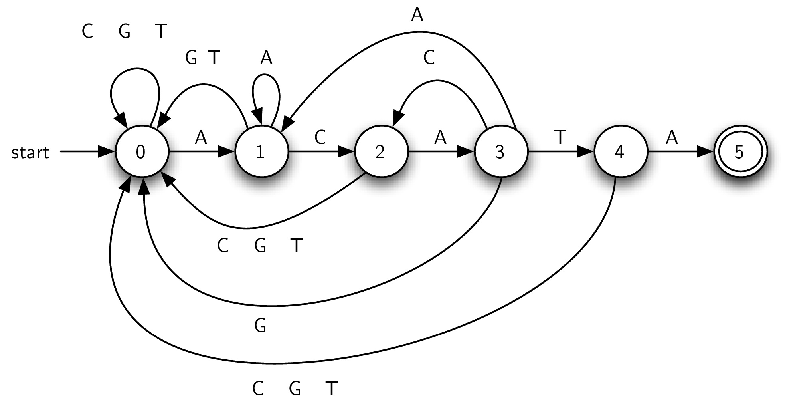
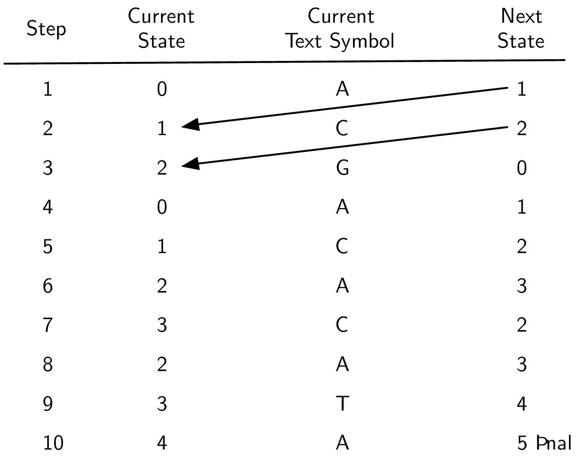
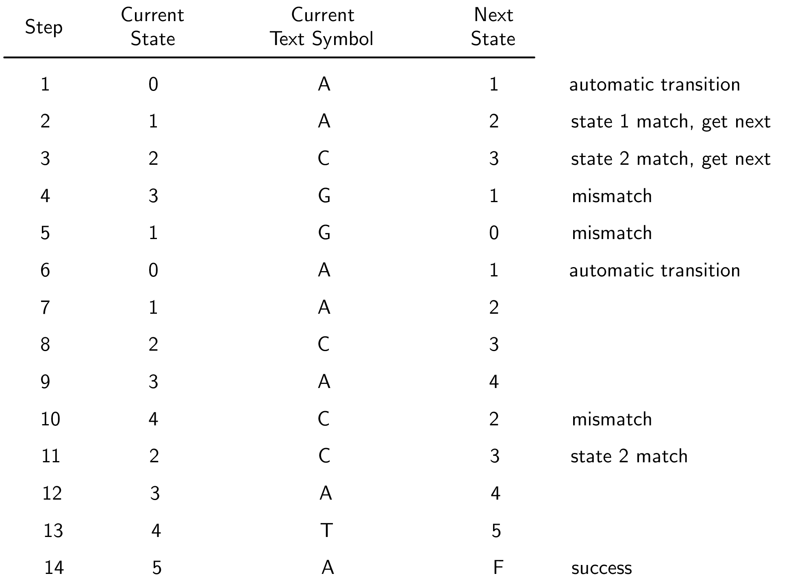

Graphs Revisited: Pattern Matching
==================================

Even with the growing interest in computer graphics, processing textual
information is still an important area of study. Of particular interest
here is the problem of finding patterns, often referred to as
**substrings**, that exist in long strings of characters. The task is to
perform some type of search that can identify at least the first
occurrence of the pattern.
We can also consider an extension of this problem to find all such occurrences.

Python includes a built-in substring method called ``find`` that returns
the location of the first occurrence of a pattern in a given string. For
example,

::

   >>> "ccabababcab".find("ab")
   2
   >>> "ccabababcab".find("xyz")
   -1
   >>>

shows that the substring ``"ab"`` occurs for the first time starting at
index position ``2`` in the string ``"ccabababcab"``. ``find`` also returns
a ``-1`` if the pattern does not occur.

Biological Strings
------------------

Some of the most exciting work in algorithm development is currently
taking place in the domain of bioinformatics; in particular, finding
ways to manage and process large quantities of biological data. Much of
this data takes the form of coded genetic material stored in the
chromosomes of individual organisms. Deoxyribonucleic acid, more
commonly known as DNA, is a very simple organic molecule that provides
the blueprint for protein synthesis.

DNA is basically a long sequence consisting of four chemical bases:
adenine(A), thymine(T), guanine(G), and cytosine(C). These four symbols
are often referred to as the *genetic alphabet* and we represent a piece
of DNA as a string or sequence of these base symbols. For example, the
**DNA string** ATCGTAGAGTCAGTAGAGACTADTGGTACGA might code a very small
part of a DNA strand. It turns out that within these long strings,
perhaps thousands and thousands of base symbols long, small pieces exist
that provide extensive information as to the meaning of this genetic
code. We can see then that having methods for searching out these pieces
is a very important tool for the bioinformatics researcher.

Our problem then reduces to the following ideas. Given a string of
symbols from the underlying alphabet A, T, G, and C, develop an
algorithm that will allow us to locate a particular pattern within that
string. We will often refer to the DNA string as the *text*. If the
pattern does not exist, we would like to know that as well. Further,
since these strings are typically quite long, we need to be sure that
the algorithm is efficient.

Simple Comparison
-----------------

Our first approach is likely the solution that comes immediately to your
mind for solving the DNA string pattern-matching problem. We will simply
try all possibilities for matching the pattern to the text.
Figure `1 <#fig_bruteforce>`__ shows how the algorithm will work. We
will start out comparing the pattern from left to right with the text,
starting at the first character in both. If there is a match, then we
proceed to check the second character. Whenever a mismatch occurs, we
simply slide the pattern one position to the right and start over.

.. figure:: Figures/simplematch.png
   :alt: A Simple Pattern-Matching Algorithm
   :name: fig_bruteforce
   :width: 5in

   A Simple Pattern-Matching Algorithm

In this example, we have found a match on the sixth attempt, starting at
position 5. The shaded characters denote the partial matches that
occurred as we moved the pattern.
Listing `[lst_simplematcher] <#lst_simplematcher>`__ shows the Python
implementation for this method. It takes the pattern and the text as
parameters. If there is a pattern match, it returns the position of the
starting text character. Otherwise, it returns ``-1`` to signal that the
search failed.

::

   def simple_matcher(pattern, text):
      i = j = 0

      while True:
         if text[i] == pattern[j]:
               j = j + 1
         else:
               j = 0
         i = i + 1

         if i == len(text):
               return -1
         if j == len(pattern):
               return i - j

The variables ``i`` and ``j`` serve as indices into the text and pattern
respectively. The loop repeats until either the text or the pattern
ends.

Line `[lst_simplematcher:line_checkmatch] <#lst_simplematcher:line_checkmatch>`__
checks for a match between the current text character and the current
pattern character. If the match occurs, pattern index is incremented. If
the match fails, we reset the pattern back to its beginning
(line `[lst_simplematcher:line_patternreset] <#lst_simplematcher:line_patternreset>`__).
In both cases we move to the next position in the text. At every
iteration of the loop we check if there is more text to process
(line `[lst_simplematcher:line_textended] <#lst_simplematcher:line_textended>`__)
and return -1 if not.
Line `[lst_simplematcher:line_patternended] <#lst_simplematcher:line_patternended>`__
checks to see if every character in the pattern has been processed. If
so, a match has been found and we return its starting index.

If we assume that the length of the text is :math:`n` characters and the
length of the pattern is :math:`m` characters, then it is easy to see
that the complexity of this approach is :math:`O(nm)`. For each of the
:math:`n` characters we may have to compare against almost all :math:`m`
of the pattern characters. This is not so bad if the size of :math:`n`
and :math:`m` are small. However, if we are considering thousands (or
perhaps millions) of characters in our text in addition a large
pattern, it will be necessary to look for a better approach.

Using Graphs: Finite State Automata
-----------------------------------

It is possible to create an :math:`O(n)` pattern matcher if we are
willing to do some preprocessing with the pattern. One approach is to
build what is known as a **deterministic finite automaton**, or **DFA**,
that represents the pattern as a graph. Each vertex of the **DFA graph**
is a state, keeping track of the amount of the pattern that has been
seen so far. Each edge of the graph represents a transition that takes
place after processing a character from the text.

Figure `2 <#fig_dfagraph>`__ shows a DFA for the example pattern from
the last section (ACATA). The first vertex (state 0) is known as the
*start state* (or *initial state*) and denotes that we have not seen any
matching pattern characters so far. Clearly, before processing the first
text character, this is the situation.

   A Deterministic Finite Automaton

The DFA works in a very simple way. We keep track of our current state,
setting it to 0 when we start. We read the next character from the text.
Depending on the character, we follow the appropriate transition to the
next state, which in turn becomes the new current state. By definition,
each state has one and only one transition for each character in the
alphabet. This means that for our DNA alphabet we know that each state
has four possible transitions to a next state. Note that in the figure
we have labeled some edges (transitions) with multiple alphabet symbols
to denote more than one transition to the same state.

We continue to follow transitions until a termination event occurs. If
we enter state 5, known as the *final state* (the two concentric circles
denote the final state in the DFA graph), we can stop and report
success. The DFA graph has discovered an occurrence of the pattern. You
might note that there are no transitions out of the final state, meaning
that we must stop at that point. The location of the pattern can be
computed from the location of the current character and the size of the
pattern. On the other hand, if we run out of text characters and the
current state is somewhere else in the DFA, known as a *nonfinal* state,
we know that the pattern did not occur.

Figure `3 <#fig_statetransitiontable>`__ shows a step-by-step trace of
the example DFA as it works through the text string ACGACACATA looking
for the substring ACATA. The next state computed by the DFA always
becomes the current state in the subsequent step. Since there is one and
only one next state for every current state–current character
combination, the processing through the DFA graph is easy to follow.

   A Trace of the DFA Pattern Matcher

Since every character from the text is used once as input to the DFA
graph, the complexity of this approach is :math:`O(n)`. However, we need
to take into account the preprocessing step that builds the DFA. There
are many well-known algorithms for producing a DFA graph from a pattern.
Unfortunately, all of them are quite complex mostly due to the fact that
each state (vertex) must have a transition (edge) accounting for each
alphabet symbol. The question arises as to whether there might be a
similar pattern matcher that employs a more streamlined set of edges.

Using Graphs: Knuth-Morris-Pratt
--------------------------------

Recall the simple pattern matcher presented earlier. Every possible
substring of the text was tested against the pattern. In many cases this
proved to be a waste of time since the actual starting point for the
match was farther down the text string. A possible solution to this
inefficiency would be to slide the pattern more than one text character
if a mismatch occurs. Figure `4 <#fig_simplematch2>`__ shows this
strategy using the rule that we slide the pattern over to the point
where the previous mismatch happened.

.. figure:: Figures/simplematch2.png
   :alt: Simple Pattern Matcher with Longer Shifts
   :name: fig_simplematch2
   :width: 5in

   Simple Pattern Matcher with Longer Shifts

In step 1, we find that the first two positions match. Since the
mismatch occurs in the third character (the shaded character), we slide
the entire pattern over and begin our next match at that point. In step
2, we fail immediately so there is no choice but to slide over to the
next position. Now, the first three positions match. However, there is a
problem. When the mismatch occurs, our algorithm says to slide over to
that point. Unfortunately, this is too far and we miss the actual
starting point for the pattern in the text string (position 5).

The reason this solution failed is that we did not take advantage of
information about the content of the pattern and the text that had been
seen in a previously attempted match. Note that in step 3, the last two
characters of the text string that occur at the time of the mismatch
(positions 5 and 6) actually match the first two characters of the
pattern. We say that a two-character prefix of the pattern matches a
two-character suffix of the text string processed up to that point. This
is valuable information. Had we been tracking the amount of overlap
between prefixes and suffixes, we could have simply slid the pattern two
characters, which would have put us in the right place to start step 4.

This observation leads to a pattern matcher known as
**Knuth-Morris-Pratt** (or **KMP**), named for the computer scientists
who first presented it. The idea is to build a graph representation that
will provide information as to the amount of “slide” that will be
necessary when a mismatch occurs. The **KMP graph** will again consist
of states and transitions (vertices and edges). However, unlike the DFA
graph from the previous section, there will be only two transitions
leaving each state.

Figure `5 <#fig_KMPgraph1>`__ shows the complete KMP graph for the
example pattern. There are two special states for a KMP graph,
the initial state and the final state. The initial state,
marked “get,” is responsible for reading the next character from the
input text. The subsequent transition, marked with an asterisk, is
always taken. Note that the start transition enters this initial state,
which means that we initially get the first character from the text and
transition immediately to the next state (state 1). The final state
(state 6), this time labeled with an “F,” again means success and
represents a termination point for the graph.

.. figure:: Figures/kmp.png
   :alt: An Example KMP Graph
   :name: fig_KMPgraph1

   An Example KMP Graph

Each remaining vertex is responsible for checking a particular character
of the pattern against the current text character. For example, the
vertex labeled “C?” asks whether the current text character is C. If so,
then the edge labeled “Y” is used. This means “yes,” there was a match.
In addition, the next character is read. In general, whenever a state is
successful in matching the character it is responsible for, the next
character is read from the text.

The remaining transitions, those labeled “N,” denote that a mismatch
occurred. In this case, as was explained above, we need to know how many
positions to slide the pattern. In essence, we want to keep the current
text character and simply move back to a previous point in the pattern.
To compute this, we use a simple algorithm that basically
checks the pattern against itself, looking for overlap between a prefix
and a suffix (see
Listing `[lst_mismatchedlinks] <#lst_mismatchedlinks>`__). If such an overlap is found, its length tells us how far
back to place the mismatched link in the KMP graph. It is important to
note that new text characters are not processed when a mismatched link is
used.

::

   def mismatched_links(pattern):
       aug_pattern = "0" + pattern
       links = {1: 0}
       for k in range(2, len(aug_pattern)):
           s = links[k - 1]
           while s >= 1:
               if aug_pattern[s] == aug_pattern[k - 1]:
                   break
               else:
                   s = links[s]
           links[k] = s + 1
       return links

Here is the example pattern as it is being processed by the
``mismatched_links`` method:

::

   >>> mismatched_links("ACATA")
   {1: 0, 2: 1, 3: 1, 4: 2, 5: 1}
   >>>

The value returned by the method is a dictionary containing key-value
pairs where the key is the current vertex (state) and the value is its
destination vertex for the mismatched link. It can be seen that each
state, from 1 to 5 corresponding to each character in the pattern, has a
transition back to a previous state in the KMP graph.

As we noted earlier, the mismatched links can be computed by sliding the
pattern past itself looking for the longest matching prefix and suffix.
The method begins by augmenting the pattern so that the indices on the
characters match the vertex labels in the KMP graph. Since the initial
state is state 0, we have used the ``“0”`` symbol as a placeholder. Now the
characters 1 to :math:`m` in the augmented pattern correspond directly
with the states 1 to :math:`m` in the graph.

Line `[lst_mismatchedlinks:line_initdict] <#lst_mismatchedlinks:line_initdict>`__
creates the first dictionary entry, which is always a transition from
vertex 1 back to the initial state where a new character is
automatically read from the text string. The iteration that follows
simply checks larger and larger pieces of the pattern, looking for
prefix and suffix overlap. If such an overlap occurs, the length of the
overlap can be used to set the next link.

Figure `6 <#fig_KMPexample>`__ shows the KMP graph as it is being used
to locate the example pattern in the text string ACGACACATA. Again,
notice that the current character changes only when a match link has
been used. In the case of a mismatch, as in steps 4 and 5, the current
character remains the same. It is not until step 6, when we have
transitioned all the way back to state 0, that we get the next character
and return to state 1.

Steps 10 and 11 show the importance of the proper mismatched link. In step
10 the current character, C, does not match the symbol that state 4
needs to match. The result is a mismatched link. However, since we have
seen a partial match at that point, the mismatched link reverts back to
state 2 where there is a correct match. This eventually leads to a
successful pattern match.

   A Trace of the KMP Pattern Matcher

As with the DFA graph from the previous section, KMP pattern matching is
:math:`O(n)` since we process each character of the text string.
However, the KMP graph is much easier to construct and requires much
less storage as there are only two transitions from every vertex.
