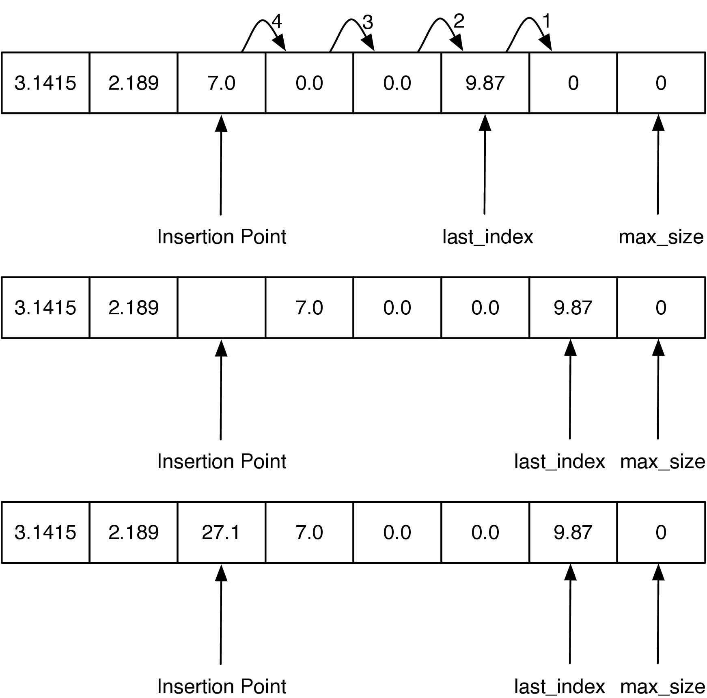

Python Lists Revisited
======================

In Chapter `[analysis] <#analysis>`__ we introduced some Big-O
performance limits on Python’s list data type. However, we did not yet
have the knowledge necessary to understand how Python implements its
list data type. in
Chapter `[basic-data-structures] <#basic-data-structures>`__ you learned
how to implement a linked list using the nodes and references pattern.
However, the nodes and references implementation still did not match the
performance of the Python list. In this section we will look at the
principles behind the Python list implementation. It is important to
recognize that this implementation is not going to be the same as
Python’s since the real Python list is implemented in the C programming
language. The idea in this section is to use Python to demonstrate the
key ideas, not to replace the C implementation.

The key to Python’s implementation of a list is to use a data type
called an *array* common to C, C++, Java, and many other programming
languages. The array is very simple and is only capable of storing one
kind of data. For example, you could have an array of integers or an
array of floating point numbers, but you cannot mix the two in a single
array. The array only supports two operations: indexing and assignment
to an array index.

The best way to think about an array is that it is one continuous block
of bytes in the computer’s memory. This block is divided up into :math:`n`-byte
chunks where :math:`n` is based on the data type that is stored in the array.
Figure `1 <#fig_array>`__ illustrates the idea of an array that is sized
to hold six floating point values.

.. figure:: Figures/array.png
   :alt: An Array of Floating Point Numbers
   :name: fig_array

   An Array of Floating Point Numbers

In Python, each floating point number uses 16 [1]_ bytes of memory. So
the array in Figure `1 <#fig_array>`__ uses a total of 96 [2]_ bytes.
The base address is the location in memory where the array starts. You
have seen addresses before in Python for different objects that you have
defined. For example: ``<__main__.Foo object at 0x5eca30>`` shows that
the object ``Foo`` is stored at memory address ``0x5eca30``. The address
is very important because an array implements the index operator using a
very simple calculation:

::

   item_address = base_address + index * size_of_object

For example, suppose that our array starts at location ``0x000040``,
which is 64 in decimal. To calculate the location of the object at
position 4 in the array we simply do the arithmetic:
:math:`64 + 4 \cdot 8 = 96`. Clearly this kind of calculation is
:math:`O(1)`. Of course this comes with some risks. First, since
the size of an array is fixed, one cannot just add things on to the end of
the array indefinitely without some serious consequences. Second, in
some languages, like C, the bounds of the array are not even checked, so
even though your array has only six elements in it, assigning a value
to index 7 will not result in a runtime error. As you might imagine this can
cause big problems that are hard to track down. In the Linux operating
system, accessing a value that is beyond the boundaries of an array will
often produce the rather uninformative error message “segmentation
violation.”

The general strategy that Python uses to implement a linked list using
an array is as follows:

-  Python uses an array that holds references (called *pointers* in C) to
   other objects.

-  Python uses a strategy called *over-allocation* to allocate an
   array with space for more objects than is needed initially.

-  When the initial array is finally filled up, a new, bigger array is
   over-allocated and the contents of the old array are copied to the
   new array.

The implications of this strategy are pretty amazing. Let’s look at what
they are first before we dive into the implementation or prove anything.

-  Accessing an itema at a specific location is :math:`O(1)`.

-  Appending to the list is :math:`O(1)` on average, but :math:`O(n)` in
   the worst case.

-  Popping from the end of the list is :math:`O(1)`.

-  Deleting an item from the list is :math:`O(n)`.

-  Inserting an item into an arbitrary position is :math:`O(n)`.

Let’s look at how the strategy outlined above works for a very simple
implementation. To begin, we will only implement the constructor, a
``__resize`` method, and the ``append`` method. We will call this class
``ArrayList``. In the constructor we will need to initialize two
instance variables. The first will keep track of the size of the current
array; we will call this ``max_size``. The second instance variable will
keep track of the current end of the list; we will call this one
``last_index``. Since Python does not have an array data type, we will
use a list to simulate an array.
Listing `[lst_arraylistinit] <#lst_arraylistinit>`__ contains the code
for the first three methods of ``ArrayList``. Notice that the
constructor method initializes the two instance variables described
above and then creates a zero element array called ``my_array``. The
constructor also creates an instance variable called ``size_exponent``.
We will understand how this variable is used shortly.

::

   class ArrayList:
       def __init__(self):
           self.size_exponent = 0
           self.max_size = 0
           self.last_index = 0
           self.my_array = []

       def append(self, val):
           if self.last_index > self.max_size - 1:  |\label{line:lst_arr_size}|
               self.__resize()
           self.my_array[self.last_index] = val
           self.last_index += 1

       def __resize(self):
           new_size = 2 ** self.size_exponent
           print("new_size = ", new_size)
           new_array = [0] * new_size
           for i in range(self.max_size):  |\label{line:lst_arr_cop1}|
               new_array[i] = self.my_array[i]

           self.max_size = new_size
           self.my_array = new_array
           self.size_exponent += 1

Next, we will implement the ``append`` method. The first thing ``append``
does is test for
the condition where ``last_index`` is greater than the number of
available index positions in the array (line `[line:lst_arr_size] <#line:lst_arr_size>`__).
If this is the case then
``__resize`` is called. Notice that we are using the double underscore
convention to make the ``resize`` method private. Once the array is resized
the new value is added to the list at ``last_index``, and ``last_index``
is incremented by one.

The ``resize`` method calculates a new size for the array using
:math:`2 ^ {size\_exponent}`. There are many methods that could be used
for resizing the array. Some implementations double the size of the
array every time as we do here, some use a multiplier of 1.5, and some
use powers of two. Python uses a multiplier of 1.125 plus a constant.
The Python developers designed this strategy as a good tradeoff for
computers of varying CPU and memory speeds. The Python strategy leads to
a sequence of array sizes of :math:`0, 4, 8, 16, 24, 32, 40, 52, 64, 76\ldots` .
Doubling the array size leads to a bit more wasted space at any
one time, but is much easier to analyze. Once a new array has been
allocated, the values from the old list must be copied into the new
array; this is done in the loop starting on
line `[line:lst_arr_cop1] <#line:lst_arr_cop1>`__. Finally the values
``max_size`` and ``last_index`` must be updated, ``size_exponent`` must
be incremented, and ``new_array`` is saved as ``self.my_array``. In a
language like C the old block of memory referenced by ``self.my_array``
would be explicitly returned to the system for reuse. However, recall
that in Python objects that are no longer referenced are automatically
cleaned up by the garbage collection algorithm.

Before we move on let’s analyze why this strategy gives us an average
:math:`O(1)` performance for ``append``. The key is to notice that most
of the time the cost to append an item :math:`c_i` is 1. The only time
that the operation is more expensive is when ``last_index`` is a power
of 2. When ``last_index`` is a power of 2 then the cost to append an
item is :math:`O(last\_index)`. We can summarize the cost to insert the
:math:`i_{th}` item as follows:

.. math::

   c_i =
   \begin{cases}
     i \text{ if } i \text{ is a power of 2} \\
     1 \text{ otherwise}
   \end{cases}

Since the expensive cost of copying ``last_index`` items occurs
relatively infrequently we spread the cost out, or *amortize*, the
cost of insertion over all of the appends. When we do this the cost of
any one insertion averages out to :math:`O(1)`. For example, consider
the case where you have already appended four items. Each of these four
appends costs you just one operation to store in the array that was
already allocated to hold four items. When the fifth item is added a new
array of size 8 is allocated and the four old items are copied. But now
you have room in the array for four additional low cost appends.
Mathematically we can show this as follows:

.. math::

   \begin{aligned}
     cost_{total} &= n + \sum_{j=0}^{\log_2{n}}{2^j}  \\
               &= n + 2n \\
               &= 3n\end{aligned}

The summation in the previous equation may not be obvious to you, so
let’s think about that a bit more. The sum goes from zero to :math:`\log_2{n}`.
The upper bound on the summation tells us how many times we
need to double the size of the array. The term :math:`2^j` accounts for
the copies that we need to do when the array is doubled. Since the total
cost to append n items is :math:`3n`, the cost for a single item is
:math:`3n/n = 3`. Because the cost is a constant we say that it is
:math:`O(1)`. This kind of analysis is called **amortized analysis** and
is very useful in analyzing more advanced algorithms.

Next, let us turn to the index operators.
Listing `[lst_arrindex] <#lst_arrindex>`__ shows our Python
implementation for index and assignment to an array location. Recall
that we discussed above that the calculation required to find the memory
location of the :math:`i_{th}` item in an array is a simple :math:`O(1)`
arithmetic expression. Even languages like C hide that calculation
behind a nice array index operator, so in this case the C and the Python
look very much the same. In fact, in Python it is very difficult to get
the actual memory location of an object for use in a calculation like
this so we will just rely on list’s built-in index operator. To confirm this,
you can always get the Python source code and look at
the file ``listobject.c``.

::

   def __getitem__(self, idx):
       if idx < self.last_index:
           return self.my_array[idx]
       raise LookupError("index out of bounds")

   def __setitem__(self, idx, val):
       if idx < self.last_index:
           self.my_array[idx] = val
       raise LookupError("index out of bounds")

Finally, let’s take a look at one of the more expensive list operations,
insertion. When we insert an item into an ``ArrayList`` we will need to
first shift everything in the list at the insertion point and beyond
ahead by one index position in order to make room for the item we are
inserting. The process is illustrated in Figure `2 <#fig_arrlistins>`__.

   Inserting 27.1 at Index 2 in an ArrayList

The key to implementing ``insert`` correctly is to realize that as you
are shifting values in the array you do not want to overwrite any
important data. The way to do this is to work from the end of the list
back toward the insertion point, copying data forward. Our implementation
of ``insert`` is shown in
Listing `[lst_arrlistins] <#lst_arrlistins>`__. Note how the ``range`` is
set up on
line `[line:lst_arrlistins_range] <#line:lst_arrlistins_range>`__ to
ensure that we are copying existing data into the unused part of the
array first, and then subsequent values are copied over old values that
have already been shifted. If the loop had started at the insertion
point and copied that value to the next larger index position in the
array, the old value would have been lost forever.

::

   def insert(self, idx, val):
       if self.last_index > self.max_size - 1:
           self.__resize()
       for i in range(self.last_index, idx - 1, -1):  |\label{line:lst_arrlistins_range}|
           self.my_array[i + 1] = self.my_array[i]
       self.last_index += 1
       self.my_array[idx] = val

The performance of the insert is :math:`O(n)` since in the worst case we
want to insert something at index 0 and we have to shift the entire
array forward by one. On average we will only need to shift half of the
array, but this is still :math:`O(n)`. You may want to go back to
Chapter `[basicds] <#basicds>`__ and remind yourself how all of these
list operations are done using nodes and references. Neither
implementation is right or wrong; they just have different performance
guarantees that may be better or worse depending on the kind of
application you are writing. In particular, do you intend to add items
to the beginning of the list most often, or does your application add
items to the end of the list? Will you be deleting items from the list
or only adding new items to the list?

There are several other interesting operations that we have not yet
implemented for our ``ArrayList`` including: ``pop``, ``del``,
``index``, and making the ``ArrayList`` iterable. We leave these
enhancements to the ``ArrayList`` as an exercise for you.

.. [1]
   8 bytes reference count + 8 bytes pointer to the type object + 8
   bytes of data = 24

.. [2]
   sys.getsizeof([3.1415, 2.189, 0.0, 0.0, 9.87]) is 104
