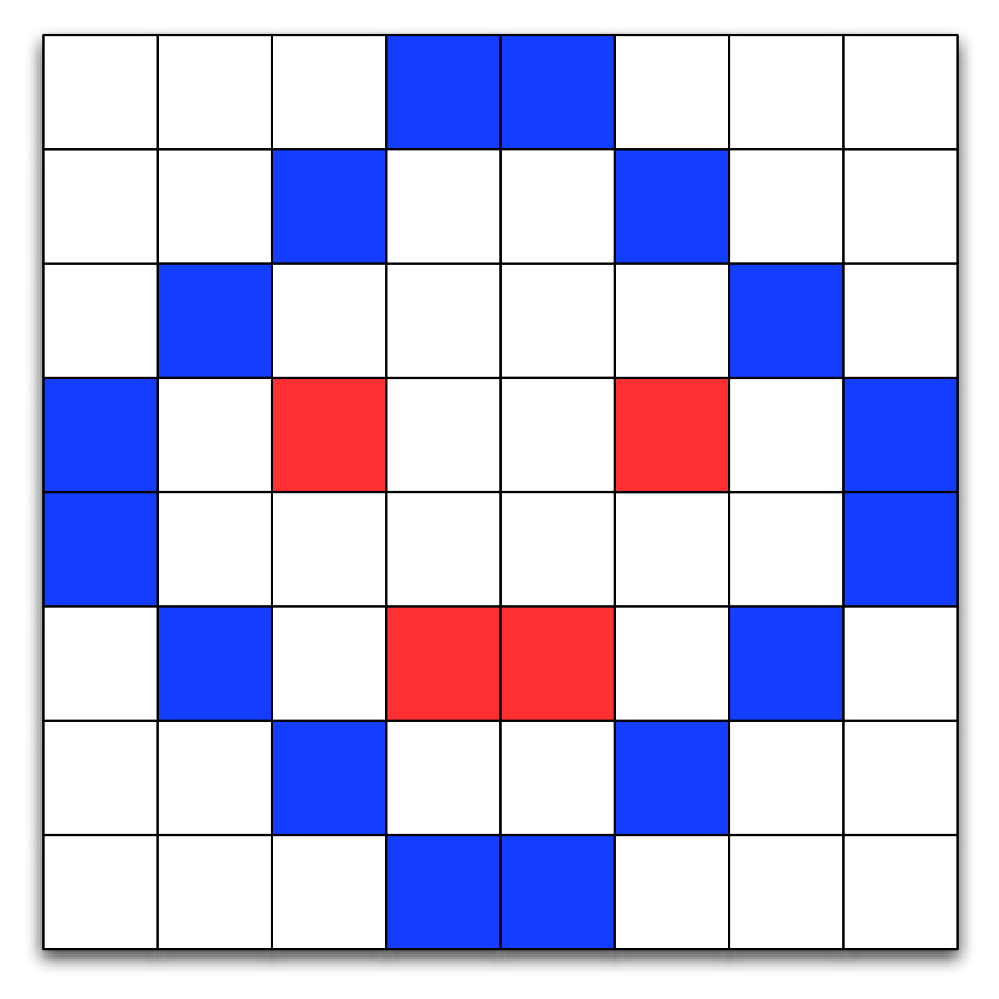
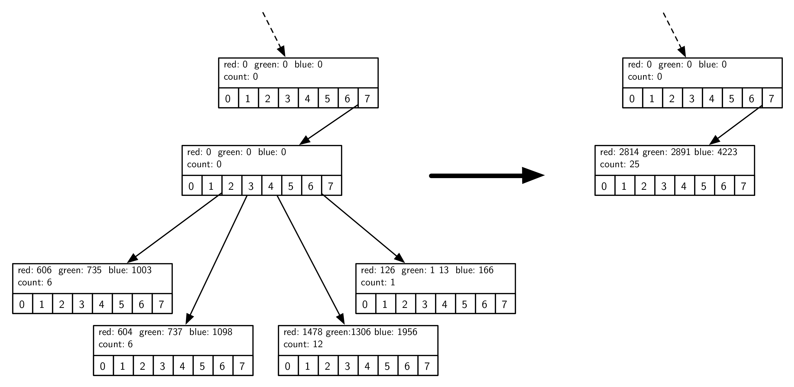

Trees Revisited: Quantizing Images
==================================

Next to text, digital images are the most common element found on the
internet. However, the internet would feel much slower if every
advertisement-sized image required 196,560 bytes of memory. Instead, a
banner ad image requires only 14,246, just 7.2% of what it could take.
Where do these numbers come from? How is such a phenomenal savings
achieved? The answers to these questions are the topic of this section.

A Quick Review of Digital Images
--------------------------------

A digital image is composed of thousands of individual components called
**pixels**. The pixels are arranged as a rectangle that forms the image.
Each pixel in an image represents a particular color in the image. On a
computer, the color of each pixel is determined by a mixture of three
primary colors: red, green, and blue. A simple example of how pixels are
arranged to form a picture is shown in Figure `1 <#fig_smallimage>`__.

   A Simple Image Composed of Pixels

In the physical world colors are not discrete quantities. The colors in
our physical world have an infinite amount of variation to them. Just as
computers must approximate floating point numbers, they also must
approximate the colors in an image. The human eye can distinguish
between 200 different levels in each of the three primary colors, or a
total of about 8 million individual colors. In practice we use one byte
(8 bits) of memory for each color component of a pixel. Eight bits gives
us 256 different levels for each of the red, green, and blue components,
for a total of 16.7 million different possible colors for each pixel.
While the huge number of colors allows artists and graphic designers to
create wonderfully detailed images, the downside of all of these color
possibilities is that image size grows very rapidly. For example, a
single image from a one-megapixel camera would take 3 megabytes of
memory.

In Python we might represent an image using a list of a list of tuples,
where the tuples consist of three numbers between 0 and 255, one for
each of the red, green, and blue components. In other languages, such as
C++ and Java, an image could be represented as a two-dimensional array.
The list of lists representation of the first two rows of the image in
Figure `1 <#fig_smallimage>`__ is shown below:

::

   im = [[(255,255,255),(255,255,255),(255,255,255),(12,28,255),
         (12,28,255),(255,255,255),(255,255,255),(255,255,255),],
         [(255,255,255),(255,255,255),(12,28,255),(255,255,255),
          (255,255,255),(12,28,255),(255,255,255),(255,255,255)],
    ... ]

The color white is represented by the tuple :math:`(255, 255, 255)`. A bluish
color is represented by the tuple :math:`(12, 28, 255)`. You can obtain the color
value for any pixel in the image by simply using list indices, for
example:

::

       >>> im[3][2]
       (255, 18, 39)

With this representation for an image in mind, you can imagine that it
would be easy to store an image to a file just by writing a tuple for
each pixel. You might start by writing the number of rows and columns in
the image and then by writing three integer values per line. In
practice, the Python package ``Pillow`` provides us with some
powerful classes. Using the ``Image`` class we can get and set pixels
using ``getpixel((col, row))`` and ``putpixel((col, row), color)``. Note
that the parameters for the image methods are in the traditional
:math:`x, y` order but many people forget and think in terms of row,
column order.

Quantizing an Image
-------------------

There are many ways of reducing the storage requirements for an image.
One of the easiest ways is to simply use fewer colors. Fewer color
choices means fewer bits for each red, green, and blue component, which
means reduced memory requirements. In fact, one of the most popular
image formats used for images on the World Wide Web uses only 256 colors
for an image. Using 256 colors reduces the storage requirements from
three bytes per pixel to one byte per pixel.

Right now you are probably asking yourself how to take an image that 
may have as many as 16 million colors and reduce it
to just 256? The answer is a process called **quantization**. To
understand the process of quantization let’s think about colors as a
three-dimensional space. Each color can be represented by a point in
space where the red component is the *x* axis, the green component is the
*y* axis, and the blue component is the *z* axis. We can think of the space
of all possible colors as a :math:`256 \times 256 \times 256` cube. The
colors closest to the vertex at :math:`(0, 0, 0)` are going to be black and dark
color shades. The colors closest to the vertex at :math:`(255, 255, 255)` are
bright and close to white. The colors closest to :math:`(255, 0, 0)` are red and
so forth.

The simplest way to think about quantizing an image is to imagine
taking the :math:`256 \times 256 \times 256` cube and turning it into an
:math:`8 \times 8 \times 8` cube. The overall size of the cube stays the
same, but now many colors in the old cube are represented by a single
color in the new cube. Figure `2 <#fig_colorcube>`__ shows an example of
the quantization just described.

.. figure:: Figures/quantizeCube.png
   :alt: Color Quantization
   :name: fig_colorcube

   Color Quantization

We can turn this simple idea of color quantization into the Python
program shown in Listing `[lst_simplequant] <#lst_simplequant>`__. The
``simple_quant`` algorithm works by mapping the color components for
each pixel represented by its full 256 bits to the color at the center
of the cube in its area. This is easy to do using integer division in
Python. In the ``simple_quant`` algorithm there are seven distinct
values in the red dimension and six distinct values in the green and
blue dimensions.

::

   from PIL import Image

   def simple_quant(filename):
       im = Image.open(filename)
       w, h = im.size
       for row in range(h):
           for col in range(w):
               r, g, b = im.getpixel((col, row))
               r = r // 36 * 36
               g = g // 42 * 42
               b = b // 42 * 42
               im.putpixel((col, row), (r, g, b))
       im.show()

   simple_quant("bubbles.jpg")

Figure `[fig_simplecompare] <#fig_simplecompare>`__ shows a before and
after comparison of original and quantized images. Of course, these
are color pictures that have been converted to gray scale for
publication.
You can use any JPEG color image from your collection and run the program to see the real difference in full color.
Notice how much
detail is lost in the quantized picture. The grass has lost nearly all
its detail and is uniformly green, and the skin tones have been reduced
to two shades of tan.

An Improved Quantization Algorithm Using Octrees
-------------------------------------------------

The problem with the simple method of quantization just described is
that the colors in most pictures are not evenly distributed throughout
the color cube. Many colors may not appear in the image, so parts of
the cube may go completely unused. Allocating an unused color to the
quantized image is a waste. Figure `3 <#fig_colordist>`__ shows the
distribution of the colors that are used in the example image. Notice
how little of the color cube space is actually used.

.. figure:: Figures/colorcube.png
   :alt: Plot of Colors Used in Image as Points in Color Cube
   :name: fig_colordist
   :height: 3in

   Plot of Colors Used in Image as Points in Color Cube

To make a better quantized image we need to find a way to do a better
job of selecting the set of colors we want to use to represent our
image. There are several algorithms for dividing the color cube in
different ways to allow for the better use of colors. In this section we
are going to look at a tree-based solution. The tree solution we will
use makes use of an **octree**. An octree is similar to a binary
tree; however, each node in an octree has eight children. Here is the
interface we will implement for our octree abstract data type:

-  ``Octree()`` creates a new empty octree.

-  ``insert(r, g, b)`` adds a new node to the octree using the red,
   green, and blue color values as the key.

-  ``find(r, g, b)`` finds an existing node, or the closest
   approximation, using the red, green, and blue color values as the
   search key.

-  ``reduce(n)`` reduces the size of the octree so that there are
   :math:`n` or fewer leaf nodes.

Here is how an octree is used to divide the color cube:

-  The root of the octree represents the entire cube.

-  The second level of the octree represents a single slice through
   each dimension (:math:`x`, :math:`y`, and :math:`z`) that evenly divides the cube into eight
   pieces.

-  The next level of the tree divides each of the eight sub-cubes into eight
   additional cubes for a total of 64 cubes. Notice that the cube
   represented by the parent node totally contains all of the sub-cubes
   represented by the children. As we follow any path down the tree we
   are staying within the boundary of the parent, but getting
   progressively more specific about the portion of the cube.

-  The eighth level of the tree represents the full resolution of 16.7
   million colors in our color cube.

Now that you know how we can represent the color cube using an
octree, you may be thinking that the octree is just another
way to divide up the color cube into even parts. You are correct.
However, because the octree is hierarchical, we can take advantage
of the hierarchy to use larger cubes to represent unused portions of the
color cube and smaller cubes to represent the popular colors. Here is an
overview of how we will use an octree to do a better job of
selecting a subset of the colors in an image:

#. For each pixel in the image:

   #. Search for the color of this pixel in the octree. The color
      will be a leaf node at the eighth level.

   #. If the color is not found create a new leaf node at the eighth
      level (and possibly some internal nodes above the leaf).

   #. If the color is already present in the tree increment the counter
      in the leaf node to keep track of how many pixels are this color.

#. Repeat until the number of leaf nodes is less than or equal to the
   target number of colors.

   #. Find the deepest leaf node with the smallest number of uses.

   #. Merge the leaf node and all of its siblings together to form a new
      leaf node.

#. The remaining leaf nodes form the color set for this image.

#. To map an original color to its quantized value simply search down
   the tree until you get to a leaf node. Return the color values stored
   in the leaf.

The ideas outlined above are encoded as a Python function to read,
quantize, and display an image in the function ``build_and_display()``
in Listing `[lst_bad] <#lst_bad>`__.

::

    def build_and_display(filename):
        img = Image.open(filename)
        w, h = img.size
        ot = Octree()
        for row in range(h):
            for col in range(w):
                r, g, b = img.getpixel((col, row))
                ot.insert(r, g, b)
        ot.reduce(256)

        for row in range(h):
            for col in range(w):
                r, g, b = img.getpixel((col, row))
                nr, ng, nb = ot.find(r, g, b)
                img.putpixel((col, row), (nr, ng, nb))
        img.show()

The ``build_and_display`` function follows the basic process just described.
First, the loops in lines
`[lst_bad:line_bldotstrt] <#lst_bad:line_bldotstrt>`__–`[lst_bad:line_bldotend] <#lst_bad:line_bldotend>`__
read each pixel and add it to the octree.
Second, the
number of leaf nodes is reduced by the ``reduce`` method on line
`[lst_bad:line_callotreduce] <#lst_bad:line_callotreduce>`__.
Finally, the image is updated by searching for a color, using ``find``,
in the reduced octree on line
`[lst_bad:line_otfind] <#lst_bad:line_otfind>`__.

We are using the Python image library to
open an existing image file (``Image.open``), read a pixel
(``getpixel``), write a pixel (``putpixel``), and display the
result to the screen (``show``). ``build_and_display`` interacts with the octree
using an instance of the ``Octree`` class (Listing `[lst_octreedef] <#lst_octreedef>`__).

::

   class octree:
       def __init__(self):
           self.root = None
           self.max_level = 5
           self.num_leaves = 0
           self.all_leaves = []

       def insert(self, r, g, b):
           if not self.root:
               self.root = self.OTNode(outer=self)
           self.root.insert(r, g, b, 0, self)

       def find(self, r, g, b):
           if self.root:
               return self.root.find(r, g, b, 0)

       def reduce(self, max_cubes):  |\label{lst_octreedef:line_otreduce}|
           while len(self.all_leaves) > max_cubes:
               smallest = self.find_min_cube()
               smallest.parent.merge()  |\label{lst_octreedef:line_otredmerge}|
               self.all_leaves.append(smallest.parent)
               self.num_leaves = self.num_leaves + 1

       def find_min_cube(self):
           min_count = sys.maxsize
           max_level = 0
           min_cube = None
           for i in self.all_leaves:
               if (
                   i.count <= min_count
                   and i.level >= max_level
               ):
                   min_cube = i
                   min_count = i.count
                   max_level = i.level
           return min_cube

First notice that the constructor for an ``Octree`` initializes the
root node to ``None``. Then it sets up three important attributes that
all the nodes of an octree may need to access. Those attributes
are ``max_level``, ``num_leaves``, and ``all_leaves``. The
``max_level`` attribute limits the total depth of the tree. Notice that
in our implementation we have initialized ``max_level`` to five. This is
a small optimization that simply allows us to ignore the two least
significant bits of color information. It keeps the overall size of the
tree much smaller and doesn’t hurt the quality of the final image at
all. The ``num_leaves`` and ``all_leaves`` attributes allow us to keep
track of the number of leaf nodes and allow us direct access to the
leaves without traversing all the way down the tree. We will see why
this is important shortly.

The ``insert`` and ``find`` methods behave exactly like their cousins in
chapter `[chap_tree] <#chap_tree>`__. They each check to see if a root
node exists, and then call the corresponding method in the root node.
Notice that ``insert`` and ``find`` both use the red, green, and blue
components (``(r, g, b)``) to identify a node in the tree.

The ``reduce`` method is defined on line
`[lst_octreedef:line_otreduce] <#lst_octreedef:line_otreduce>`__ of
Listing `[lst:octreedef] <#lst:octreedef>`__. This method simply loops
until the number of leaves in the leaf list is less than the total
number of colors we want to have in the final image (defined by the
parameter ``max_cubes``). ``reduce`` makes use of a helper function
``find_min_cube`` to find the node in the octree with the smallest
reference count. Once the node with the smallest reference count is
found, that node is merged into a single node with all of its siblings
(see line
`[lst_octreedef:line_otredmerge] <#lst_octreedef:line_otredmerge>`__).

The ``find_min_cube`` method is implemented using the ``all_leaves`` and
a simple find minimum loop pattern. When the number of leaf nodes is
large, and it could be as large is 16.7 million, this approach is not
very efficient. In one of the exercises you are asked to modify the
``Octree`` class and improve the efficiency of ``find_min_cube``.

One of the things to mention about the ``Octree`` class is that it uses an instance
of the class ``OTNode`` which is defined inside the the ``Octree`` class. A class
that is defined inside another class is called an *inner class*.
We define ``OTNode`` inside ``Octree`` because each node
of an octree needs to have access to some information that is
stored in an instance of the ``Octree`` class. Another reason for making
``OTNode`` an inner class is that there is no reason for any code
outside of the ``Octree`` class to use it. The way that an octree
is implemented is really a private detail that nobody
else needs to know about. This is a good software engineering practice
known as *information hiding*.

Now let’s look at the class definition for the nodes in an octree
(Listing `[lst_otnodedef] <#lst_otnodedef>`__).
The constructor for the ``OTNode`` class has three optional parameters: ``parent``,
``level``, and ``outer``.
These parameters allow the ``Octree`` methods to construct new
nodes under a variety of circumstances. As we did with binary search
trees, we will keep track of the parent of a node explicitly. The level
of the node simply indicates its depth in the tree. The most interesting
of these three parameters is the ``outer`` parameter, which is a
reference to the instance of the ``octree`` class that created this
node. ``outer`` will function like ``self`` in that it will allow the
instances of ``OTNode`` to access attributes of an instance of
``Octree``.

The other attributes that we want to remember about each node in an
``octree`` include the reference ``count`` and the red, green, and blue
components of the color represented by this tree. As you will note in
the ``insert`` function, only a leaf node of the tree will have values
for ``red``, ``green``, ``blue``, and ``count``. Also note that since
each node can have up to eight children we initialize a list of eight
references to keep track of them all. Rather than a left and right child
as in binary trees, an octree has 0–7 children.

::

   class OTNode:
       def __init__(self, parent=None, level=0, outer=None):
           self.red = 0
           self.green = 0
           self.blue = 0
           self.count = 0
           self.parent = parent
           self.level = level
           self.oTree = outer
           self.children = [None] * 8

Now we get into the really interesting parts of the octree
implementation. The Python code for inserting a new node into an
octree is shown in Listing `[lst_otninsert] <#lst_otninsert>`__.
The first problem we need to solve is how to figure out where to place a
new node in the tree. In a binary search tree we used the rule that a
new node with a key less than its parent went in the left subtree, and a
new node with a key greater than its parent went in the right subtree.
But with eight possible children for each node it is not that simple. In
addition, when indexing colors it is not obvious what the key for each
node should be. In an ``octree`` we will use the information from the
three color components. Figure `4 <#fig_otindex>`__ shows how we can use
the red, green, and blue color values to compute an index for the
position of the new node at each level of the tree. The corresponding
Python code for computing the index is on
line `[lst_otninsert:line_otci] <#lst_otninsert:line_otci>`__ of
Listing `[lst_otninsert] <#lst_otninsert>`__.

::

   def insert(self, r, g, b, level, outer):
       if level < self.oTree.max_level:
           idx = self.compute_index(
               r, g, b, level
           )
           if self.children[idx] == None:
               self.children[idx] = outer.OTNode(
                   parent=self,
                   level=level + 1,
                   outer=outer,
               )
           self.children[idx].insert(
               r, g, b, level + 1, outer
           )
       else:
           if self.count == 0:
               self.oTree.num_leaves = (
                   self.oTree.num_leaves + 1
               )
               self.oTree.all_leaves.append(self)
           self.red += r
           self.green += g
           self.blue += b
           self.count = self.count + 1

   def compute_index(self, r, g, b, l):  |\label{lst_otninsert:line_otci}|
       shift = 8 - l
       rc = r >> shift - 2 & 0x4
       gc = g >> shift - 1 & 0x2
       bc = b >> shift & 0x1
       return rc | gc | bc

The computation of the index combines bits from each of the red, green,
and blue color components, starting at the top of the tree with the
highest order bits. Figure `4 <#fig_otindex>`__ shows the binary
representation of the red, green, and blue components of 163, 98, 231.
At the root of the tree we start with the most significant bit from each
of the three color components; in this case the three bits are 1, 0, and
1. Putting these bits together we get binary 101 or decimal 5. You can
see the binary manipulation of the red, green, and blue numbers in the
``compute_index`` method on
line `[lst_otninsert:line_otci] <#lst_otninsert:line_otci>`__ in
Listing `[lst_otninsert] <#lst_otninsert>`__.

The operators used in the ``compute_index`` may be unfamiliar to you.
The ``>>`` operator is the right shift operation. The ``&`` is bitwise
``and``, and ``|`` is logical ``or``. The bitwise ``or`` and bitwise
``and`` operations work just like the logical operations used in
conditionals, except that they work on the individual bits of a number.
The shift operation simply moves the bits :math:`n` places to the right,
filling in with zeros on the left and dropping the bits as they go off
the right.

Once we have computed the index appropriate for the current level of the tree,
we traverse down into the subtree. In the example in
Figure `4 <#fig_otindex>`__ we follow the link at position 5 in the
``children`` array. If there is no node at position 5, we create one. We
keep traversing down the tree until we get to ``max_level``. At
``max_level`` we stop searching and store the data. Notice that we do
not overwrite the data in the leaf node, but rather we add the color
components to any existing components and increment the reference
counter. This allows us to compute the average of any color below the
current node in the color cube. In this way, a leaf node in the
``octree`` may represent a number of similar colors in the color cube.

.. figure:: Figures/octreeIndex.png
   :alt: Computing an Index to Insert a Node in an octree
   :name: fig_otindex
   :height: 4.5in

   Computing an Index to Insert a Node in an octree

The ``find`` method, shown in Listing `[lst_otnfind] <#lst_otnfind>`__,
uses the same method of index computation as the ``insert`` method to
traverse the tree in search of a node matching the red, green, and blue
components. 

::

   def find(self, r, g, b, level):
       if level < self.oTree.max_level:
           idx = self.compute_index(r, g, b, level)
           if self.children[idx]:
               return self.children[idx].find(
                   r, g, b, level + 1
               )
           elif self.count > 0:
               return (
                   self.red // self.count,
                   self.green // self.count,
                   self.blue // self.count,
               )
           else:
               print("No leaf node to represent this color")
       else:
           return (
               self.red // self.count,
               self.green // self.count,
               self.blue // self.count,
           )

The ``find`` method has three exit conditions:

#. We have reached the maximum level of the tree and so we return the
   average of the color information stored in this leaf node (see lines 17--21).

#. We have found a leaf node at a height less than ``max_level`` (see lines 9--13).
   This is possible only after the tree has been reduced. See below.

#. We try to follow a path into a nonexistent subtree, which is an
   error.

The final aspect of the ``OTNode`` class is the ``merge`` method. It
allows a parent to subsume all of its children and become a leaf node
itself. If you remember back to the structure of the ``octree`` where
each parent cube fully encloses all the cubes represented by the
children, you will see why this makes sense. When we merge a group of
siblings we are effectively taking a weighted average of the colors
represented by each of those siblings. Since all the siblings are
relatively close to each other in color space, the average is a good
representation of all of them. Figure `5 <#fig_otmerge>`__ illustrates
the merge process for some sibling nodes.

   Merging Four Leaf Nodes of an ``octree``

Figure `5 <#fig_otmerge>`__ shows the red, green, and blue components
represented by the four leaf nodes whose identifying color values are
(101, 122, 167), (100, 122, 183), (123, 108, 163), and (126, 113, 166).
As you can see in Listing `[lst_otnfind] <#lst_otnfind>`__
the identifying values are calculated dividing the color values by the count.
Notice how close they are in the overall color space. The leaf node that gets
created from all of these has an ID of (112, 115, 168). This is close to
the average of the four, but weighted more towards the third color tuple
due to the fact that it had a reference count of 12.

::

    def merge(self):
        for child in [c for c in self.children if c]:
            if child.count > 0:
                self.o_tree.all_leaves.remove(child)
                self.o_tree.num_leaves -= 1
            else:
                print("Recursively merging non-leaf...")
                child.merge()
            self.count += child.count
            self.red += child.red
            self.green += child.green
            self.blue += child.blue
        for i in range(8):
            self.children[i] = None

Because the ``octree`` uses only colors that are really present in the
image and faithfully preserves colors that are often used, the final
quantized image from the ``octree`` is much higher quality than the
simple method we used to start this section.
Figure `[fig_otquantcompare] <#fig_otquantcompare>`__ shows a comparison
of the original image with the quantized image.

There are many additional ways to compress images using techniques such
as run-length encoding, discrete cosine transform, and Huffman coding.
Any of these algorithms are within your grasp and we encourage you to
look them up and read about them. In addition, quantized images can be
improved by using a technique known as **dithering**. Dithering is a
process by which different colors are placed near each other so that
the eye blends the colors together, forming a more realistic image. This
is an old trick used by newspapers for doing color printing using just
black plus three different colors of ink. Again you can research
dithering and try to apply it to some images on your own.
