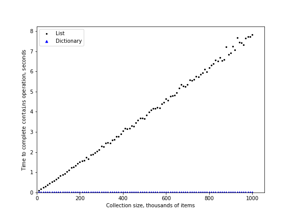

..  Copyright (C)  Brad Miller, David Ranum
    This work is licensed under the Creative Commons Attribution-NonCommercial-ShareAlike 4.0 International License. To view a copy of this license, visit http://creativecommons.org/licenses/by-nc-sa/4.0/.

Dictionaries
~~~~~~~~~~~~

The second major Python data structure is the dictionary. As you
probably recall, dictionaries differ from lists in that you can access
items in a dictionary by a key rather than a position. Later in this
book you will see that there are many ways to implement a dictionary.
The thing that is most important to notice right now is that the ``get
item`` and ``set item`` operations on a dictionary are :math:`O(1)`. Another
important dictionary operation is the ``contains`` operation. Checking to
see whether a key is in the dictionary or not is also :math:`O(1)`.
The efficiency of all dictionary operations is summarized in
:ref:`Table 3 <tbl_dictbigo>`. One important side note on dictionary performance
is that the efficiencies we provide in the table are for average
performance. In some rare cases the ``contains``, ``get item``, and ``set item``
operations can degenerate into :math:`O(n)` performance, but we will
get into that in Chapter 8 when we talk about the different ways
that a dictionary could be implemented.

.. _tbl_dictbigo:

.. table:: **Table 3: Big O Efficiency of Python Dictionary Operations**

    ====================== ==================
                 Operation   Big O Efficiency
    ====================== ==================
                  ``copy``               O(n)
              ``get item``               O(1)
              ``set item``               O(1)
           ``delete item``               O(1)
         ``contains (in)``               O(1)
             ``iteration``               O(n)
    ====================== ==================

For our last performance experiment we will compare the performance of
the contains operation between lists and dictionaries. In the process we
will confirm that the contains operator for lists is :math:`O(n)` and
the contains operator for dictionaries is :math:`O(1)`. The experiment
we will use to compare the two is simple: we’ll make a list with a range
of numbers in it, then we will pick numbers at random and check to see
if the numbers are in the list. If our performance tables are correct,
the bigger the list, the longer it should take to determine if any one
number is contained in the list.

We will repeat the same experiment for a dictionary that contains
numbers as the keys. In this experiment we should see that determining
whether or not a number is in the dictionary is not only much faster,
but the time it takes to check should remain constant even as the
dictionary grows larger.

:ref:`Listing 6 <lst_listvdict>` implements this comparison. Notice that we are
performing exactly the same operation, ``number in container``. The
difference is that on line 8 ``x`` is a list, and on line 10 ``x`` is a
dictionary.

.. _lst_listvdict:

**Listing 6**

.. sourcecode:: python
    :linenos:

    import timeit
    import random

    print(f"{'n':10s}{'list':>10s}{'dict':>10s}")
    for i in range(10_000, 1_000_001, 20_000):
        t = timeit.Timer(f"random.randrange({i}) in x", 
        "from __main__ import random, x")
        x = list(range(i))
        lst_time = t.timeit(number=1000)
        x = {j: None for j in range(i)}
        dict_time = t.timeit(number=1000)
        print(f"{i:<10,}{lst_time:>10.3f}{dict_time:>10.3f}")

:ref:`Figure 4 <fig_listvdict>` summarizes the results of running
:ref:`Listing 6 <lst_listvdict>`. You can see that the dictionary is consistently
faster. For the smallest list size of 10,000 elements a dictionary is
89.4 times faster than a list. For the largest list size of 990,000
elements the dictionary is 11,603 times faster! You can also see that
the time it takes for the ``contains`` operator on the list grows linearly
with the size of the list. This verifies the assertion that the ``contains``
operator on a list is :math:`O(n)`. It can also be seen that the time
for the ``contains`` operator on a dictionary is constant even as the
dictionary size grows. In fact, for a dictionary size of 10,000 the
``contains`` operation took 0.004 milliseconds, and for the dictionary size
of 990,000 it also took 0.004 milliseconds.

.. _fig_listvdict:

    Figure 4: Comparing the ``in`` Operator for Python Lists and Dictionaries

Since Python is an evolving language, there are always changes going on
behind the scenes. The latest information on the performance of Python
data structures can be found on the Python website. As of this writing
the Python wiki has a nice **time complexity** page that can be found at the
`Time Complexity Wiki <http://wiki.python.org/moin/TimeComplexity>`_.

.. admonition:: Self Check

    .. mchoice:: mcpyperform
       :answer_a: a_list.pop(0)
       :answer_b: a_list.pop()
       :answer_c: a_list.append()
       :answer_d: a_list[10]
       :answer_e: all of the above are O(1)
       :correct: a
       :feedback_a: When you remove the first element of a list, all the other elements of the list must be shifted forward.
       :feedback_b: Removing an element from the end of the list is a constant operation.
       :feedback_c: Appending to the end of the list is a constant operation
       :feedback_d: Indexing a list is a constant operation
       :feedback_e: There is one operation that requires all other list elements to be moved.

       Which of the list operations shown below is not O(1)?

    .. mchoice:: mcpydictperf
      :answer_a: "x" in a_dict
      :answer_b: del a_dict["x"]
      :answer_c: a_dict["x"] == 10
      :answer_d: a_dict["x"] = a_dict["x"] + 1
      :answer_e: all of the above are O(1)
      :correct: e
      :feedback_a: in is a constant operation for a dictionary because you do not have to iterate but there is a better answer.
      :feedback_b: deleting an element from a dictionary is a constant operation but there is a better answer.
      :feedback_c: Assignment to a dictionary key is constant but there is a better answer.
      :feedback_d: Re-assignment to a dictionary key is constant but there is a better answer.
      :feedback_e: The only dictionary operations that are not O(1) are those that require iteration.

      Which of the dictionary operations shown below is O(1)?

.. youtube:: zKq8iVEX6gU
    :divid: pythonopsperf
    :height: 315
    :width: 560
    :align: left
