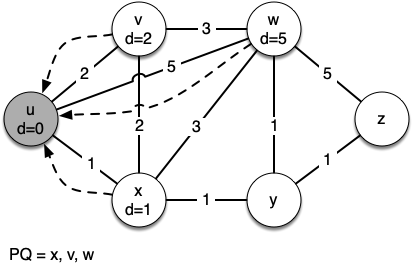
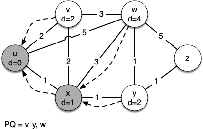
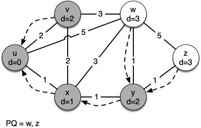

..  Copyright (C)  Brad Miller, David Ranum
    This work is licensed under the Creative Commons Attribution-NonCommercial-ShareAlike 4.0 International License. To view a copy of this license, visit http://creativecommons.org/licenses/by-nc-sa/4.0/.

Dijkstra’s Algorithm
~~~~~~~~~~~~~~~~~~~~

The algorithm we are going to use to determine the shortest path is
called Dijkstra’s algorithm. Dijkstra’s algorithm is an iterative
algorithm that provides us with the shortest path from one particular
starting node to all other nodes in the graph. Again this is similar to
the results of a breadth-first search.

To keep track of the total cost from the start node to each destination,
we will make use of the ``distance`` instance variable in the ``Vertex`` class.
The ``distance`` instance variable will contain the current total weight of
the smallest weight path from the start to the vertex in question. The
algorithm iterates once for every vertex in the graph; however, the
order that it iterates over the vertices is controlled by a priority
queue. The value that is used to determine the order of the objects in
the priority queue is ``distance``. When a vertex is first created, ``distance``
is set to a very large number. Theoretically you would set ``distance`` to
infinity, but in practice we just set it to a number that is larger than
any real distance we would have in the problem we are trying to solve.

The code for Dijkstra’s algorithm is shown in :ref:`Listing 1 <lst_shortpath>`. When the algorithm finishes, the distances are set
correctly as are the predecessor links for each vertex in the graph.

.. _lst_shortpath:

**Listing 1**

::

   from pythonds3.graphs import PriorityQueue

   def dijkstra(graph, start):
      pq = PriorityQueue()
      start.distance = 0
      pq.heapify([(v.distance, v) for v in graph])
      while pq:
         distance, current_v = pq.delete()
         for next_v in current_v.get_neighbors():
               new_distance = current_v.distance + current_v.get_neighbor(next_v)
               if new_distance < next_v.distance:
                  next_v.distance = new_distance
                  next_v.previous = current_v
                  pq.change_priority(next_v, new_distance)

Dijkstra’s algorithm uses a priority queue. You may recall that a
priority queue is based on the heap that we implemented in Chapter 6. 
There are a couple of differences between that
simple implementation and the implementation we
use for Dijkstra’s algorithm, however. First, the ``PriorityQueue`` class stores
tuples of (priority, key) pairs. This is an important point,
because Dijkstra's algorithm requires the key in the priority queue to match
the key of the vertex in the graph.
The priority is used for deciding the position of the key
in the priority queue. In this implementation we
use the distance to the vertex as the priority because as we will see
when we are exploring the next vertex, we always want to explore the
vertex that has the smallest distance. The second difference is the
addition of the ``change_priority`` method. As you can see in line 17,
this method is used when the distance to a vertex that
is already in the queue is reduced,
and thus the vertex is moved toward the front of the queue.

Let’s walk through an application of Dijkstra’s algorithm one vertex at
a time using the following sequence of figures as our guide. We begin with the vertex
:math:`u`. The three vertices adjacent to :math:`u` are
:math:`v, w,` and :math:`x`. Since the initial distances to
:math:`v, w,` and :math:`x` are all initialized to ``sys.maxsize``,
the new costs to get to them through the start node are all their direct
costs. So we update the costs to each of these three nodes. We also set
the predecessor for each node to :math:`u` and we add each node to the
priority queue. We use the distance as the key for the priority queue.
The state of the algorithm is shown in :ref:`Figure 3 <fig_dija>`.

In the next iteration of the ``while`` loop we examine the vertices that
are adjacent to :math:`x`. The vertex :math:`x` is next because it
has the lowest overall cost and therefore bubbled its way to the
beginning of the priority queue. At :math:`x` we look at its neighbors
:math:`u, v, w,` and :math:`y`. For each neighboring vertex we check to
see if the distance to that vertex through :math:`x` is smaller than
the previously known distance. Obviously this is the case for
:math:`y` since its distance was ``sys.maxsize``. It is not the case
for :math:`u` or :math:`v` since their distances are 0 and 2
respectively. However, we now learn that the distance to :math:`w` is
smaller if we go through :math:`x` than from :math:`u` directly to
:math:`w`. Since that is the case we update :math:`w` with a new
distance and change the predecessor for :math:`w` from :math:`u` to
:math:`x`. See :ref:`Figure 4 <fig_dijb>` for the state of all the vertices.

The next step is to look at the vertices neighboring :math:`v` (see :ref:`Figure 5 <fig_dijc>`). This
step results in no changes to the graph, so we move on to node
:math:`y`. At node :math:`y` (see :ref:`Figure 6 <fig_dijd>`) we discover that it is cheaper to get
to both :math:`w` and :math:`z`, so we adjust the distances and
predecessor links accordingly. Finally we check nodes :math:`w` and
:math:`z` (see :ref:`Figure 6 <fig_dije>` and :ref:`Figure 8 <fig_dijf>`). However, no additional changes are found and so the
priority queue is empty and Dijkstra’s algorithm exits.

   
.. _fig_dija:

   Figure 3: Tracing Dijkstra’s Algorithm      
   
.. _fig_dijb:

   Figure 4: Tracing Dijkstra’s Algorithm     
   
.. _fig_dijc:

.. figure:: Figures/dijkstrac.png
   :align: center

   Figure 5: Tracing Dijkstra’s Algorithm      
   
.. _fig_dijd:

   Figure 6: Tracing Dijkstra’s Algorithm      
   
.. _fig_dije:

.. figure:: Figures/dijkstrae.png
   :align: center

   Figure 7: Tracing Dijkstra’s Algorithm      
   
.. _fig_dijf:

.. figure:: Figures/dijkstraf.png
   :align: center

   Figure 8: Tracing Dijkstra’s Algorithm      

It is important to note that Dijkstra’s algorithm works only when the
weights are all positive. You should convince yourself that if you
introduced a negative weight on one of the edges of the graph
in :ref:`Figure 2 <fig_network>`, the algorithm would never exit.

We will note that to route messages through the internet, other
algorithms are used for finding the shortest path. One of the problems
with using Dijkstra’s algorithm on the internet is that you must have a
complete representation of the graph in order for the algorithm to run.
The implication of this is that every router has a complete map of all
the routers in the internet. In practice this is not the case and other
variations of the algorithm allow each router to discover the graph as
they go. One such algorithm that you may want to read about is called
the *distance vector* routing algorithm.

