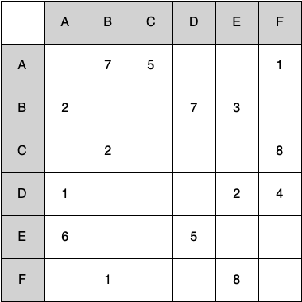

..  Copyright (C)  Brad Miller, David Ranum
    This work is licensed under the Creative Commons Attribution-NonCommercial-ShareAlike 4.0 International License. To view a copy of this license, visit http://creativecommons.org/licenses/by-nc-sa/4.0/.

:skipreading:`True`

Exercises
---------

#. Draw the graph corresponding to the following adjacency matrix.

#. Draw the graph corresponding to the following list of edges.

   .. table:: 

           +--------+------+--------+
           | from   | to   | cost   |
           +========+======+========+
           | 1      | 2    | 10     |
           +--------+------+--------+
           | 1      | 3    | 15     |
           +--------+------+--------+
           | 1      | 6    | 5      |
           +--------+------+--------+
           | 2      | 3    | 7      |
           +--------+------+--------+
           | 3      | 4    | 7      |
           +--------+------+--------+
           | 3      | 6    | 10     |
           +--------+------+--------+
           | 4      | 5    | 7      |
           +--------+------+--------+
           | 6      | 4    | 5      |
           +--------+------+--------+
           | 5      | 6    | 13     |
           +--------+------+--------+

#. Ignoring the weights, perform a breadth-first search on the graph
   drawn for question 1 or 2.

.. activecode:: breadthfirst
   :coach:
   
.. mchoice:: question1_1
   :answer_a: O(n)
   :answer_b: O(n2)
   :answer_c: O(1)
   :answer_d: O(n3)
   :correct: b
   :feedback_a: O(n) would suggest that there is no nesting. There are several nested for loops.
   :feedback_b: Correct. The two consecutively nested for loops would dictate that this is in the realm of O(n2).
   :feedback_c: O(1) would suggest that the function is constant. Since there are multiple for loops intertwined, it is not in constant time.
   :feedback_d: O(n3) would suggest that there are three consecutively nested for loops. There are only two.
   
#. What is the Big-O running time of the ``build_graph`` function?

.. shortanswer:: BigO

#. Derive the Big-O running time for the topological sort algorithm.

.. shortanswer:: BigOTwo

#. Derive the Big-O running time for the strongly connected components
   algorithm.

#. Show each step in applying Dijkstra’s algorithm to the graph
   drawn for question 1 or 2.

#. Using Prim’s algorithm, find the minimum weight spanning tree for the graph
   drawn for question 1 or 2.

.. activecode:: primsalg
   :coach:

#. Draw a dependency graph illustrating the steps needed to send an
   email. Perform a topological sort on your graph.

#. Express branching factor :math:`k` as a function of the board size :math:`n`.

#. Derive an expression for the base of the exponent used in expressing the 
    running time of the knights tour.
    
.. shortanswer:: DFS

#. Explain why the general DFS algorithm is not suitable for solving 
    the knight's tour problem.

.. mchoice:: question1_2
   :answer_a: O(1)
   :answer_b: O(n3) 
   :answer_c: O(n)
   :answer_d: O(n2)
   :correct: d
   :feedback_a: O(1) would mean that the algorithm runs in constant time. This isn't true because there are several comparisons happening in the algorithm.
   :feedback_b: O(n3) suggests that there are three consecutively nested loops. If you look at the example algorithm, it is obvious that there are not three nested loops.
   :feedback_c: O(n) is linear time. The time it takes for this program to run doesn't grow linearly.
   :feedback_d: Correct. Since you are not only comparing the weight of a branch but also if the branch has already been connected to, this would make the Big-O of the algorithm O(n2)

#. What is the Big-O running time for Prim’s minimum 
    spanning tree algorithm?

#. Modify the depth-first search function to produce a topological sort.

#. Modify the depth-first search to produce strongly connected
   components.

#. Write the ``transpose`` method for the ``Graph`` class.

#. Using breadth-first search write an algorithm that can determine the
   shortest path from each vertex to every other vertex. This is called
   the “all pairs shortest path problem.”

#. Using breadth-first search revise the maze program from
   the Chapter 4 (Recursion) to find the shortest path out of a maze.

#. Write a program to solve the following problem: you have two jugs, a
   4-gallon and a 3-gallon. Neither of the jugs has any markings.
   There is a pump that can be used to fill the jugs with water. How can
   you get exactly two gallons of water in the 4-gallon jug?

#. Generalize the problem above so that the parameters to your solution
   include the size of each jug and the final amount of water to be
   left in the larger jug.

#. Write a program that solves the following problem: three missionaries
   and three cannibals come to a river and find a boat that holds two
   people. Everyone must get across the river to continue on the
   journey. However, if the cannibals ever outnumber the missionaries on
   either bank, the missionaries will be eaten. Find a series of
   crossings that will get everyone safely to the other side of the
   river.

