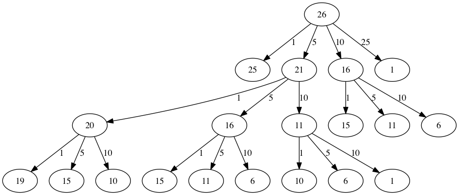
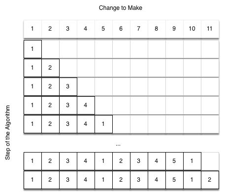

..  Copyright (C)  Brad Miller, David Ranum
    This work is licensed under the Creative Commons Attribution-NonCommercial-ShareAlike 4.0 International License. To view a copy of this license, visit http://creativecommons.org/licenses/by-nc-sa/4.0/.

Dynamic Programming
-------------------

Many programs in computer science are written to optimize some value;
for example, find the shortest path between two points, find the line
that best fits a set of points, or find the smallest set of objects that
satisfies some criteria. There are many strategies that computer
scientists use to solve these problems. One of the goals of this book is
to expose you to several different problem-solving strategies. **Dynamic
programming** is one strategy for these types of optimization problems.

A classic example of an optimization problem involves making change
using the fewest coins. Suppose you are a programmer for a vending
machine manufacturer. Your company wants to streamline effort by giving
out the fewest possible coins in change for each transaction. Suppose a
customer puts in a dollar bill and purchases an item for 37 cents. What
is the smallest number of coins you can use to make change? The answer
is six coins: two quarters, one dime, and three pennies. How did we
arrive at the answer of six coins? We start with the largest coin in our
arsenal (a quarter) and use as many of those as possible, then we go to
the next lowest coin value and use as many of those as possible. This
first approach is called a **greedy method** because we try to solve as
big a piece of the problem as possible right away.

The greedy method works fine when we are using U.S. coins, but suppose
that your company decides to deploy its vending machines in Lower
Elbonia where, in addition to the usual 1, 5, 10, and 25 cent coins they
also have a 21 cent coin. In this instance our greedy method fails to
find the optimal solution for 63 cents in change. With the addition of
the 21 cent coin the greedy method would still find the solution to be
six coins. However, the optimal answer is three 21 cent pieces.

Let’s look at a method where we could be sure that we would find the
optimal answer to the problem. Since this section is about recursion,
you may have guessed that we will use a recursive solution. Let’s start
with identifying the base case. If we are trying to make change for the
same amount as the value of one of our coins, the answer is easy, one
coin.

If the amount does not match we have several options. What we want is
the minimum of a penny plus the number of coins needed to make change
for the original amount minus a penny, or a nickel plus the number of
coins needed to make change for the original amount minus five cents, or
a dime plus the number of coins needed to make change for the original
amount minus ten cents, and so on. So the number of coins needed to make
change for the original amount can be computed according to the
following:

.. math::

      num\_coins =
   min
   \begin{cases}
   1 + num\_coins(original\ amount - 1) \\
   1 + num\_coins(original\ amount - 5) \\
   1 + num\_coins(original\ amount - 10) \\
   1 + num\_coins(original\ amount - 25)
   \end{cases}
   \label{eqn_change}

The algorithm for doing what we have just described is shown in
:ref:`Listing 17 <lst_change1>`. In line 3 we are checking our base case;
that is, we are trying to make change in the exact amount of one of our
coins. If we do not have a coin equal to the amount of change, we make
recursive calls for each different coin value less than the amount of
change we are trying to make. Line 6 shows how we filter the
list of coins to those less than the current value of change using a
list comprehension. The recursive call also reduces the total amount of
change we need to make by the value of the coin selected. The recursive
call is made in line 7. Notice that on that same line we add 1
to our number of coins to account for the fact that we are using a coin.
Just adding 1 is the same as if we had made a recursive call asking
where we satisfy the base case condition immediately.

.. _lst_change1:

.. highlight:: python
    :linenothreshold: 5

**Listing 17:** Recursive Version of Coin Optimization Problem

::

    def make_change_1(coin_denoms, change):
        if change in coin_denoms:
            return 1
        min_coins = float("inf")
        for i in [c for c in coin_denoms if c <= change]:
            num_coins = 1 + make_change_1(
                coin_denoms, change - i
            )
            min_coins = min(num_coins, min_coins)
        return min_coins

   print(make_change_1([1, 5, 10, 25], 63))

.. highlight:: python
    :linenothreshold: 500

The trouble with the algorithm in :ref:`Listing 17 <lst_change1>` is that it is
extremely inefficient. In fact, it takes 67,716,925 recursive calls to
find the optimal solution to the 4 coins, 63 cents problem! To
understand the fatal flaw in our approach look at :ref:`Figure 14 <fig_c1ct>`,
which illustrates a small fraction of the 377 function calls needed to
find the optimal set of coins to make change for 26 cents.

Each node in the graph corresponds to a call to ``make_change_1``. The label on
the node indicates the amount of change for which we are computing the
number of coins. The label on the arrow indicates the coin that we just
used. By following the graph we can see the combination of coins that
got us to any point in the graph. The main problem is that we are
redoing too many calculations. For example, the graph shows that the
algorithm would recalculate the optimal number of coins to make change
for 15 cents at least three times. Each of these computations to find
the optimal number of coins for 15 cents itself takes 52 function calls.
Clearly we are wasting a lot of time and effort recalculating old
results.

.. _fig_c1ct:

   Figure 14: Call Tree for Listing 17

The key to cutting down on the amount of work we do is to remember some
of the past results so we can avoid recomputing results we already know.
A simple solution is to store the results for the minimum number of
coins in a table when we find them. Then before we compute a new
minimum, we first check the table to see if a result is already known.
If there is already a result in the table, we use the value from the
table rather than recomputing. :ref:`ActiveCode 1 <lst_change2>` shows a modified
algorithm to incorporate our table lookup scheme.

.. activecode:: lst_change2
    :caption: Recursively Counting Coins with Table Lookup
    :nocodelens:

    def make_change_2(coin_value_list, change, known_results):
        min_coins = change
        if change in coin_value_list:
            known_results[change] = 1
            return 1
        elif known_results[change] > 0:
            return known_results[change]
        else:
            for i in [c for c in coin_value_list if c <= change]:
                num_coins = 1 + make_change_2(coin_value_list, change - i, known_results)
                if num_coins < min_coins:
                    min_coins = num_coins
                known_results[change] = min_coins
        return min_coins

    print(make_change_2([1, 5, 10, 25], 63, [0] * 64))

Notice that in line 6 we have added a test to see if our table
contains the minimum number of coins for a certain amount of change. If
it does not, we compute the minimum recursively and store the computed
minimum in the table. Using this modified algorithm reduces the number
of recursive calls we need to make for the four coin, 63 cent problem to
221 calls!

Although the algorithm in :ref:`AcitveCode 1 <lst_change2>` is correct, it looks and
feels like a bit of a hack.  Also, if we look at the ``known_results`` lists
we can see that there are some holes in the table. In fact the term for
what we have done is not dynamic programming but rather we have improved
the performance of our program by using a technique known as
*memoization*, or more commonly called *caching*.

A truly dynamic programming algorithm will take a more systematic
approach to the problem. Our dynamic programming solution is going to
start with making change for one cent and systematically work its way up
to the amount of change we require. This guarantees that at each step
of the algorithm we already know the minimum number of coins needed to
make change for any smaller amount.

Let’s look at how we would fill in a table of minimum coins to use in
making change for 11 cents. :ref:`Figure 15 <fig_dpcoins>` illustrates the
process. We start with one cent. The only solution possible is one coin
(a penny). The next row shows the minimum for one cent and two cents.
Again, the only solution is two pennies. The fifth row is where things
get interesting. Now we have two options to consider, five pennies or
one nickel. How do we decide which is best? We consult the table and see
that the number of coins needed to make change for four cents is four,
plus one more penny to make five, equals five coins. Or we can look at
zero cents plus one more nickel to make five cents equals one coin. Since
the minimum of one and five is one we store 1 in the table. Fast forward
again to the end of the table and consider 11 cents. :ref:`Figure 16 <fig_eleven>`
shows the three options that we have to consider:

#. A penny plus the minimum number of coins to make change for
   :math:`11-1 = 10` cents (1)

#. A nickel plus the minimum number of coins to make change for
   :math:`11 - 5 = 6` cents (2)

#. A dime plus the minimum number of coins to make change for
   :math:`11 - 10 = 1` cent (1)

Either option 1 or 3 will give us a total of two coins which is the
minimum number of coins for 11 cents.

.. _fig_dpcoins:

**Figure 15:** Minimum Number of Coins Needed to Make Change

.. _fig_eleven:
   
**Figure 16:** Three Options to Consider for the Minimum Number of Coins for Eleven Cents

.. figure:: Figures/elevenCents.png
   :align: center
   :alt: image

:ref:`Listing 19 <lst_dpchange>` is a dynamic programming algorithm to solve our
change-making problem. ``make_change_3`` takes three parameters: a list
of valid coin values, the amount of change we want to make, and a list
of the minimum number of coins needed to make each value. When the
function is done, ``min_coins`` will contain the solution for all values
from 0 to the value of ``change``.

.. _lst_dpchange:

**Listing 19:** Dynamic Programming Solution

::

   def make_change_3(coin_value_list, change, min_coins):
      for cents in range(change + 1):
         coin_count = cents
         for j in [c for c in coin_value_list if c <= cents]:
               if min_coins[cents - j] + 1 < coin_count:
                  coin_count = min_coins[cents - j] + 1
         min_coins[cents] = coin_count
      return min_coins[change]

Note that ``make_change_3`` is not a recursive function, even though we
started with a recursive solution to this problem. It is 
important to realize that a recursive solution to a problem will not 
necessarily be the most efficient solution. The
bulk of the work in this function is done by the loop that starts on
line 4. In this loop we consider using all possible coins to
make change for the amount specified by ``cents``. Like we did for the
11 cent example above, we remember the minimum value and store it in our
``min_coins`` list.

Although our making change algorithm does a good job of figuring out the
minimum number of coins, it does not help us make change since we do not
keep track of the coins we use. We can easily extend ``make_change_3`` to
keep track of the coins used by simply remembering the last coin we add
for each entry in the ``min_coins`` table. If we know the last coin
added, we can simply subtract the value of the coin to find a previous
entry in the table that tells us the last coin we added to make that
amount. We can keep tracing back through the table until we get to the
beginning.

:ref:`ActiveCode 2 <lst_dpremember>` shows ``make_change_4``, based on
the ``make_change_3`` algorithm but
modified to keep track of the coins used, along with a function
``print_coins`` that walks backward through the table to print out the
value of each coin used.
This shows the algorithm in
action solving the problem for our friends in Lower Elbonia. The first
two lines of ``main`` set the amount to be converted and create the list of coins used. The next two
lines create the lists we need to store the results. ``coins_used`` is a
list of the coins used to make change, and ``coin_count`` is the minimum
number of coins used to make change for the amount corresponding to the
position in the list.

Notice that the coins we print out come directly from the ``coins_used``
array. For the first call we start at array position 63 and print 21.
Then we take :math:`63 - 21 = 42` and look at the 42nd element of the
list. Once again we find a 21 stored there. Finally, element 21 of the
array also contains 21, giving us the three 21 cent pieces.

.. activecode:: lst_dpremember
    :caption: Complete Solution to the Change Problem
    :nocodelens:

    def make_change_4(coin_value_list, change, min_coins, coins_used):
        for cents in range(change + 1):
            coin_count = cents
            new_coin = 1
            for j in [c for c in coin_value_list if c <= cents]:
                if min_coins[cents - j] + 1 < coin_count:
                    coin_count = min_coins[cents - j] + 1
                    new_coin = j
            min_coins[cents] = coin_count
            coins_used[cents] = new_coin
        return min_coins[change]

    def print_coins(coins_used, change):
        coin = change
        while coin > 0:
            this_coin = coins_used[coin]
            print(this_coin, end=" ")
            coin = coin - this_coin
        print()

    def main():
        amnt = 63
        clist = [1, 5, 10, 21, 25]
        coins_used = [0] * (amnt + 1)
        coin_count = [0] * (amnt + 1)

        print(
           "Making change for {} requires the following {} coins: ".format(
                 amnt, make_change_4(clist, amnt, coin_count, coins_used)
           ),
           end="",
        )
        print_coins(coins_used, amnt)
        print("The used list is as follows:")
        print(coins_used)

    main()

