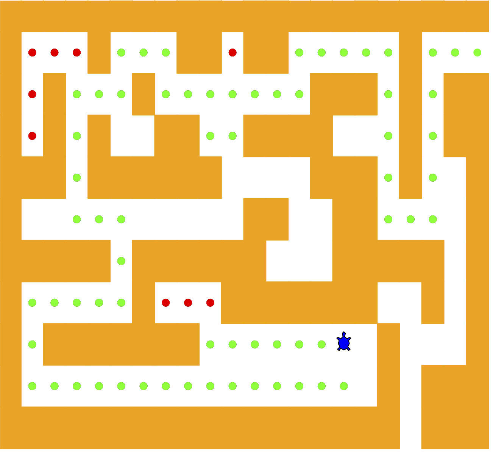

..  Copyright (C)  Brad Miller, David Ranum
    This work is licensed under the Creative Commons Attribution-NonCommercial-ShareAlike 4.0 International License. To view a copy of this license, visit http://creativecommons.org/licenses/by-nc-sa/4.0/.

Exploring a Maze
----------------

In this section we will look at a problem that has relevance to the
expanding world of robotics: how do you find your way out of a maze? If you have
a Roomba vacuum cleaner for your dorm room (don’t all college students?)
you will wish that you could reprogram it using what you have learned in
this section. The problem we want to solve is to help our turtle find
its way out of a virtual maze. The maze problem has roots as deep as the
Greek myth about Theseus, who was sent into a maze to kill the Minotaur.
Theseus used a ball of thread to help him find his way back out again
once he had finished off the beast. In our problem we will assume that
our turtle is dropped down somewhere into the middle of the maze and
must find its way out. Look at :ref:`Figure 2 <fig_mazescreen>` to get an idea of
where we are going in this section.

.. _fig_mazescreen:

   Figure 2: The Finished Maze Search Program

To make it easier for us we will assume that our maze is divided up into
squares. Each square of the maze is either open or occupied by a
section of wall. The turtle can only pass through the open squares of
the maze. If the turtle bumps into a wall, it must try a different
direction. The turtle will require a systematic procedure to find its
way out of the maze. Here is the procedure:

#. From our starting position we will first try going north one square
   and then recursively try our procedure from there.

#. If we are not successful by trying a northern path as the first step
   then we will take a step to the south and recursively repeat our
   procedure.

#. If south does not work then we will try a step to the West as our
   first step and recursively apply our procedure.

#. If north, south, and west have not been successful then we will apply the
   procedure recursively from a position one step to our east.

#. If none of these directions works then there is no way to get out of
   the maze and we fail.

Now that sounds pretty easy, but there are a couple of details to talk
about first. Suppose we take our first recursive step by going north. By
following our procedure, our next step would also be to the north. But if
the north is blocked by a wall, we must look at the next step of the
procedure and try going to the south. Unfortunately, that step to the
south brings us right back to our original starting place. If we apply
the recursive procedure from there, we will just go back one step to the
North and be in an infinite loop. So we must have a strategy to
remember where we have been. In this case we will assume that we have a
bag of bread crumbs we can drop along our way. If we take a step in a
certain direction and find that there is a bread crumb already on that
square, we know that we should immediately back up and try the next
direction in our procedure. As we will see when we look at the code for
this algorithm, backing up is as simple as returning from a recursive
function call.

As we do for all recursive algorithms, let us review the base cases. Some
of them you may already have guessed based on the description in the
previous paragraph. In this algorithm, there are four base cases to
consider:

#. The turtle has run into a wall. Since the square is occupied by a
   wall, no further exploration can take place.

#. The turtle has found a square that has already been explored. We do
   not want to continue exploring from this position so we don't get into a loop.

#. We have found an outside edge, not occupied by a wall. In other words,
   we have found an exit from the maze.

#. We have explored a square unsuccessfully in all four directions.

For our program to work we will need to have a way to represent the
maze. To make this even more interesting we are going to use the turtle
module to draw and explore our maze so we can watch this algorithm in
action. The ``Maze`` object will provide the following methods for us to use
in writing our search algorithm:

-  ``__init__`` Reads in a data file representing a maze, initializes
   the internal representation of the maze, and finds the starting
   position for the turtle.

-  ``draw_maze`` Draws the maze in a window on the screen.

-  ``update_position`` Updates the internal representation of the maze
   and changes the position of the turtle in the window.

-  ``is_exit`` Checks to see if the current position is an exit from the
   maze.

The ``Maze`` class also overloads the index operator ``[]`` so that our
algorithm can easily access the status of any particular square.

Let’s examine the code for the search function which we call
``search_from``. The code is shown in :ref:`Listing 3 <lst_mazesearch>`. Notice
that this function takes three parameters: a ``Maze`` object, the starting
row, and the starting column. This is important because as a recursive
function the search logically starts again with each recursive call.

.. _lst_mazesearch:

.. highlight:: python
    :linenothreshold: 5
    
**Listing 3**

::

    def search_from(maze, row, column):
        # Try each of four directions from this point until we find a way out.
        maze.update_position(row, column)
        # Base Case return values:
        #  1. We have run into an obstacle, return false
        if maze[row][column] == OBSTACLE:
            return False
        #  2. We have found an already explored square
        if maze[row][column] in [TRIED, DEAD_END]:
            return False
        # 3. We have found an exit
        if maze.is_exit(row, column):
            maze.update_position(row, column, PART_OF_PATH)
            return True
        maze.update_position(row, column, TRIED)
        # Otherwise, use logical short circuiting to try each direction
        # in turn (if needed)
        found = (
            search_from(maze, row - 1, column)
            or search_from(maze, row + 1, column)
            or search_from(maze, row, column - 1)
            or search_from(maze, row, column + 1)
        )
        if found:
            maze.update_position(row, column, PART_OF_PATH)
        else:
            maze.update_position(row, column, DEAD_END)
        return found

As you look through the algorithm you will see that the first thing the
code does (line 3) is call ``update_position``. This is simply to help
you visualize the algorithm so that you can watch exactly how the turtle
explores its way through the maze. Next the algorithm checks for the
first three of the four base cases: Has the turtle run into a wall (lines
6)? Has the turtle circled back to a square already explored (line 9)?
Has the turtle found an exit (line 12)? If none of these conditions is
true then we continue the search recursively.

You will notice that in the recursive step there are four recursive
calls to ``search_from``. It is hard to predict how many of these
recursive calls will be used since they are all connected by ``or``
statements. If the first call to ``search_from`` returns ``True`` then
none of the last three calls would be needed. You can interpret this as
meaning that a step to ``(row - 1, column)`` (or north if you want to think
geographically) is on the path leading out of the maze. If there is not
a good path leading out of the maze to the north then the next recursive
call is tried, this one to the south. If south fails then try west, and
finally east. If all four recursive calls return ``False`` then we have
found a dead end. You should download or type in the whole program and
experiment with it by changing the order of these calls.

The code for the ``Maze`` class is shown in :ref:`Listing 4 <lst_maze>`, :ref:`Listing 5 <lst_maze1>`, and :ref:`Listing 6 <lst_maze2>`. 
The ``__init__`` method takes the name of a file as its
only parameter. This file is a text file that represents a maze by using
“+” characters for walls, spaces for open squares, and the letter “S” to
indicate the starting position. :ref:`Figure 3 <fig_exmaze>` is an example of a
maze data file. The internal representation of the maze is a list of
lists. Each row of the ``maze_list`` instance variable is also a list.
This secondary list contains one character per square using the
characters described above. For the data file in :ref:`Figure 3 <fig_exmaze>` the
internal representation looks like the following:

.. highlight:: python
    :linenothreshold: 500

::

    [ ['+','+','+','+',...,'+','+','+','+','+','+','+'],
      ['+',' ',' ',' ',...,' ',' ',' ','+',' ',' ',' '],
      ['+',' ','+',' ',...,'+','+',' ','+',' ','+','+'],
      ['+',' ','+',' ',...,' ',' ',' ','+',' ','+','+'],
      ['+','+','+',' ',...,'+','+',' ','+',' ',' ','+'],
      ['+',' ',' ',' ',...,'+','+',' ',' ',' ',' ','+'],
      ['+','+','+','+',...,'+','+','+','+','+',' ','+'],
      ['+',' ',' ',' ',...,'+','+',' ',' ','+',' ','+'],
      ['+',' ','+','+',...,' ',' ','+',' ',' ',' ','+'],
      ['+',' ',' ',' ',...,' ',' ','+',' ','+','+','+'],
      ['+','+','+','+',...,'+','+','+',' ','+','+','+']]

The ``draw_maze`` method uses this internal representation to draw the
initial view of the maze on the screen.

.. _fig_exmaze:

Figure 3: An Example Maze Data File

::
    
      ++++++++++++++++++++++
      +   +   ++ ++     +   
      + +   +       +++ + ++
      + + +  ++  ++++   + ++
      +++ ++++++    +++ +  +
      +          ++  ++    +
      +++++ ++++++   +++++ +
      +     +   +++++++  + +
      + +++++++      S +   +
      +                + +++
      ++++++++++++++++++ +++

The ``update_position`` method, as shown in :ref:`Listing 5 <lst_maze1>` uses the
same internal representation to see if the turtle has run into a wall.
It also updates the internal representation with a “.” or “-” to
indicate that the turtle has visited a particular square or if the
square is part of a dead end. In addition, the ``update_position`` method
uses two helper methods, ``move_turtle`` and ``drop_bread_crumb``, to
update the view on the screen.

Finally, the ``is_exit`` method uses the current position of the turtle
to test for an exit condition. An exit condition is whenever the turtle
has navigated to the edge of the maze, either row zero or column zero,
or the far-right column or the bottom row.

.. _lst_maze:

**Listing 4**

.. highlight:: python
    :linenothreshold: 500

::

    class Maze:
        def __init__(self, maze_filename):
            rows_in_maze = 0
            columns_in_maze = 0
            self.maze_list = []
            maze_file = open(maze_filename, "r")
            rows_in_maze = 0
            for line in maze_file:
                row_list = []
                col = 0
                for ch in line[:-1]:
                    row_list.append(ch)
                    if ch == "S":
                        self.start_row = rows_in_maze
                        self.start_col = col
                    col = col + 1
                rows_in_maze = rows_in_maze + 1
                self.maze_list.append(row_list)
                columns_in_maze = len(row_list)

            self.rows_in_maze = rows_in_maze
            self.columns_in_maze = columns_in_maze
            self.x_translate = -columns_in_maze / 2
            self.y_translate = rows_in_maze / 2
            self.t = turtle.Turtle()
            self.t.shape("turtle")
            self.wn = turtle.Screen()
            self.wn.setworldcoordinates(
                -(columns_in_maze - 1) / 2 - 0.5,
                -(rows_in_maze - 1) / 2 - 0.5,
                (columns_in_maze - 1) / 2 + 0.5,
                (rows_in_maze - 1) / 2 + 0.5,
            )

.. _lst_maze1:

**Listing 5**

::

        def draw_maze(self):
            self.t.speed(10)
            self.wn.tracer(0)
            for y in range(self.rows_in_maze):
                for x in range(self.columns_in_maze):
                    if self.maze_list[y][x] == OBSTACLE:
                        self.draw_centered_box(
                            x + self.x_translate, -y + self.y_translate, "orange"
                        )
            self.t.color("black")
            self.t.fillcolor("blue")
            self.wn.update()
            self.wn.tracer(1)

        def draw_centered_box(self, x, y, color):
            self.t.up()
            self.t.goto(x - 0.5, y - 0.5)
            self.t.color(color)
            self.t.fillcolor(color)
            self.t.setheading(90)
            self.t.down()
            self.t.begin_fill()
            for i in range(4):
                self.t.forward(1)
                self.t.right(90)
            self.t.end_fill()

        def move_turtle(self, x, y):
            self.t.up()
            self.t.setheading(self.t.towards(x + self.x_translate, -y + self.y_translate))
            self.t.goto(x + self.x_translate, -y + self.y_translate)

        def drop_bread_crumb(self, color):
            self.t.dot(10, color)

        def update_position(self, row, col, val=None):
            if val:
                self.maze_list[row][col] = val
            self.move_turtle(col, row)

            if val == PART_OF_PATH:
                color = "green"
            elif val == OBSTACLE:
                color = "red"
            elif val == TRIED:
                color = "black"
            elif val == DEAD_END:
                color = "red"
            else:
                color = None

            if color:
                self.drop_bread_crumb(color)

.. _lst_maze2:

**Listing 6**

::

        def is_exit(self, row, col):
            return (
                row == 0
                or row == self.rows_in_maze - 1
                or col == 0
                or col == self.columns_in_maze - 1
            )

        def __getitem__(self, idx):
            return self.maze_list[idx]

The complete program is shown in ActiveCode 1.  This program uses the data file ``maze2.txt`` shown below.
Note that it is a much more simple example file in that the exit is very close to the starting position of the turtle.

.. raw:: html

	<pre id="maze2.txt">
  ++++++++++++++++++++++
  +   +   ++ ++        +
        +     ++++++++++
  + +    ++  ++++ +++ ++
  + +   + + ++    +++  +
  +          ++  ++  + +
  +++++ + +      ++  + +
  +++++ +++  + +  ++   +
  +          + + S+ +  +
  +++++ +  + + +     + +
  ++++++++++++++++++++++
    </pre>

.. activecode:: completemaze
    :caption: Complete Maze Solver
    :nocodelens:
    :timelimit: off

    import turtle

    PART_OF_PATH = "O"
    TRIED = "."
    OBSTACLE = "+"
    DEAD_END = "-"

    class Maze:
        def __init__(self, maze_filename):
            rows_in_maze = 0
            columns_in_maze = 0
            self.maze_list = []
            maze_file = open(maze_filename, "r")
            rows_in_maze = 0
            for line in maze_file:
                row_list = []
                col = 0
                for ch in line[:-1]:
                    row_list.append(ch)
                    if ch == "S":
                        self.start_row = rows_in_maze
                        self.start_col = col
                    col = col + 1
                rows_in_maze = rows_in_maze + 1
                self.maze_list.append(row_list)
                columns_in_maze = len(row_list)

            self.rows_in_maze = rows_in_maze
            self.columns_in_maze = columns_in_maze
            self.x_translate = -columns_in_maze / 2
            self.y_translate = rows_in_maze / 2
            self.t = turtle.Turtle()
            self.t.shape("turtle")
            self.wn = turtle.Screen()
            self.wn.setworldcoordinates(
                -(columns_in_maze - 1) / 2 - 0.5,
                -(rows_in_maze - 1) / 2 - 0.5,
                (columns_in_maze - 1) / 2 + 0.5,
                (rows_in_maze - 1) / 2 + 0.5,
            )

        def draw_maze(self):
            self.t.speed(10)
            self.wn.tracer(0)
            for y in range(self.rows_in_maze):
                for x in range(self.columns_in_maze):
                    if self.maze_list[y][x] == OBSTACLE:
                        self.draw_centered_box(
                            x + self.x_translate, -y + self.y_translate, "orange"
                        )
            self.t.color("black")
            self.t.fillcolor("blue")
            self.wn.update()
            self.wn.tracer(1)

        def draw_centered_box(self, x, y, color):
            self.t.up()
            self.t.goto(x - 0.5, y - 0.5)
            self.t.color(color)
            self.t.fillcolor(color)
            self.t.setheading(90)
            self.t.down()
            self.t.begin_fill()
            for i in range(4):
                self.t.forward(1)
                self.t.right(90)
            self.t.end_fill()

        def move_turtle(self, x, y):
            self.t.up()
            self.t.setheading(self.t.towards(x + self.x_translate, -y + self.y_translate))
            self.t.goto(x + self.x_translate, -y + self.y_translate)

        def drop_bread_crumb(self, color):
            self.t.dot(10, color)

        def update_position(self, row, col, val=None):
            if val:
                self.maze_list[row][col] = val
            self.move_turtle(col, row)

            if val == PART_OF_PATH:
                color = "green"
            elif val == OBSTACLE:
                color = "red"
            elif val == TRIED:
                color = "black"
            elif val == DEAD_END:
                color = "red"
            else:
                color = None

            if color:
                self.drop_bread_crumb(color)

        def is_exit(self, row, col):
            return (
                row == 0
                or row == self.rows_in_maze - 1
                or col == 0
                or col == self.columns_in_maze - 1
            )

        def __getitem__(self, idx):
            return self.maze_list[idx]

    def search_from(maze, start_row, start_column):
        # try each of four directions from this point until we find a way out.
        # base Case return values:
        #  1. We have run into an obstacle, return false
        maze.update_position(start_row, start_column)
        if maze[start_row][start_column] == OBSTACLE:
            return False
        #  2. We have found a square that has already been explored
        if (
            maze[start_row][start_column] == TRIED
            or maze[start_row][start_column] == DEAD_END
        ):
            return False
        # 3. We have found an outside edge not occupied by an obstacle
        if maze.is_exit(start_row, start_column):
            maze.update_position(start_row, start_column, PART_OF_PATH)
            return True
        maze.update_position(start_row, start_column, TRIED)
        # Otherwise, use logical short circuiting to try each direction
        # in turn (if needed)
        found = (
            search_from(maze, start_row - 1, start_column)
            or search_from(maze, start_row + 1, start_column)
            or search_from(maze, start_row, start_column - 1)
            or search_from(maze, start_row, start_column + 1)
        )
        if found:
            maze.update_position(start_row, start_column, PART_OF_PATH)
        else:
            maze.update_position(start_row, start_column, DEAD_END)
        return found

    my_maze = Maze("maze2.txt")
    my_maze.draw_maze()
    my_maze.update_position(my_maze.start_row, my_maze.start_col)

    search_from(my_maze, my_maze.start_row, my_maze.start_col)

.. admonition:: Self Check

   Modify the maze search program so that the calls to ``search_from`` are in a different order.
   Watch the program run. Can you explain why the behavior is different?
   Can you predict what path the turtle will follow for a given change in order?
