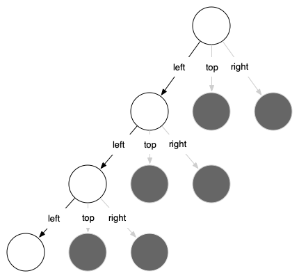

..  Copyright (C)  Brad Miller, David Ranum
    This work is licensed under the Creative Commons Attribution-NonCommercial-ShareAlike 4.0 International License. To view a copy of this license, visit http://creativecommons.org/licenses/by-nc-sa/4.0/.

Sierpinski Triangle
-------------------

Another fractal that exhibits the property of self-similarity is the
Sierpinski triangle. An example is shown in :ref:`Figure 4.9 <fig_sierpinski>`. The
Sierpinski triangle illustrates a three-way recursive algorithm. The
procedure for drawing a Sierpinski triangle by hand is simple. Start
with a single large triangle. Divide this large triangle into four new
triangles by connecting the midpoint of each side. Ignoring the middle
triangle that you just created, apply the same procedure to each of the
three corner triangles. Each time you create a new set of triangles, you
recursively apply this procedure to the three smaller corner triangles.
You can continue to apply this procedure indefinitely if you have a
sharp enough pencil. Before you continue reading, you may want to try
drawing the Sierpinski triangle yourself, using the method described.

.. _fig_sierpinski:

**Figure 4.9:** The Sierpinski Triangle

.. figure:: Figures/sierpinski.png
     :align: center
     :width: 480px

Since we can continue to apply the algorithm indefinitely, what is the
base case? We will see that the base case is set arbitrarily as the
number of times we want to divide the triangle into pieces. Sometimes we
call this number the *degree* of the fractal. Each time we make a
recursive call, we subtract 1 from the degree until we reach 0. When we
reach a degree of 0, we stop making recursive calls. The code that
generated the Sierpinski Triangle in :ref:`Figure 4.9 <fig_sierpinski>` is shown in
:ref:`ActiveCode 4.8.1 <lst_st>`.

.. activecode:: lst_st
    :caption: Drawing a Sierpinski Triangle
    :nocodelens:

    import turtle

    def draw_triangle(points, color, my_turtle):
        my_turtle.fillcolor(color)
        my_turtle.up()
        my_turtle.goto(points[0][0], points[0][1])
        my_turtle.down()
        my_turtle.begin_fill()
        my_turtle.goto(points[1][0], points[1][1])
        my_turtle.goto(points[2][0], points[2][1])
        my_turtle.goto(points[0][0], points[0][1])
        my_turtle.end_fill()

    def get_mid(p1, p2):
        return ((p1[0] + p2[0]) / 2, (p1[1] + p2[1]) / 2)

    def sierpinski(points, degree, my_turtle):
        colormap = ["blue", "red", "green", "white", "yellow", "violet", "orange"]
        draw_triangle(points, colormap[degree], my_turtle)
        if degree > 0:
            sierpinski(
                [points[0], get_mid(points[0], points[1]), get_mid(points[0], points[2])],
                degree - 1,
                my_turtle,
            )
            sierpinski(
                [points[1], get_mid(points[0], points[1]), get_mid(points[1], points[2])],
                degree - 1,
                my_turtle,
            )
            sierpinski(
                [points[2], get_mid(points[2], points[1]), get_mid(points[0], points[2])],
                degree - 1,
                my_turtle,
            )

    def main():
        my_turtle = turtle.Turtle()
        my_win = turtle.Screen()
        my_points = [[-180, -150], [0, 150], [180, -150]]
        sierpinski(my_points, 5, my_turtle)
        my_win.exitonclick()

    main()

The program in :ref:`ActiveCode 4.8.1 <lst_st>` follows the ideas outlined above. The
first thing ``sierpinski`` does is draw the outer triangle. Next, there
are three recursive calls, one for each of the new corner triangles we
get when we connect the midpoints. Once again we make use of the
standard ``turtle`` module that comes with Python. You can learn all the
details of the methods available in the turtle module by using
``help("turtle")`` from the Python prompt.

Look at the code and think about the order in which the triangles will
be drawn. While the exact order of the corners depends upon how the
initial set is specified, let’s assume that the corners are ordered
lower left, top, lower right. Because of the way the ``sierpinski``
function calls itself, ``sierpinski`` works its way to the smallest
allowed triangle in the lower-left corner and then begins to fill out
the rest of the triangles working back. Then it fills in the triangles
in the top corner by working toward the smallest, topmost triangle.
Finally, it fills in the lower-right corner, working its way toward the
smallest triangle in the lower right.

Sometimes it is helpful to think of a recursive algorithm in terms of a
diagram of function calls. :ref:`Figure 4.10 <fig_stcalltree>` shows that the recursive
calls are always made going to the left. The active functions are
outlined in black, and the inactive function calls are in gray. The
farther you go toward the bottom of :ref:`Figure 4.10 <fig_stcalltree>`, the smaller the
triangles. The function finishes drawing one level at a time; once it is
finished with the bottom left it moves to the bottom middle, and so on.

.. _fig_stcalltree:

**Figure 4.10:** Building a Sierpinski Triangle

The ``sierpinski`` function relies heavily on the ``get_mid`` function.
``get_mid`` takes as arguments two endpoints and returns the point
halfway between them. In addition, :ref:`ActiveCode 4.8.1 <lst_st>` has a function that
draws a filled triangle using the ``begin_fill`` and ``end_fill`` turtle
methods.
