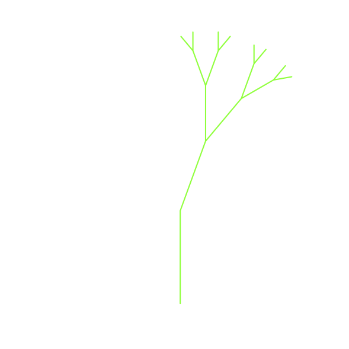

..  Copyright (C)  Brad Miller, David Ranum
    This work is licensed under the Creative Commons Attribution-NonCommercial-ShareAlike 4.0 International License. To view a copy of this license, visit http://creativecommons.org/licenses/by-nc-sa/4.0/.

Visualizing Recursion
=====================

In the previous section we looked at some problems that were easy to
solve using recursion; however, it can still be difficult to find a
mental model or a way of visualizing what is happening in a recursive
function. This can make recursion difficult for people to grasp. In this
section we will look at a couple of examples of using recursion to draw
some interesting pictures. As you watch these pictures take shape you
will get some new insight into the recursive process that may be helpful
in cementing your understanding of recursion.

The tool we will use for our illustrations is Python’s turtle graphics
module called ``turtle``. The ``turtle`` module is standard with all
versions of Python and is very easy to use. The metaphor is quite
simple. You can create a turtle and the turtle can move forward,
move backward, turn left, turn right, etc. The turtle can have its tail up or
down. When the turtle’s tail is down and the turtle moves, it draws a
line as it moves. To increase the artistic value of the turtle, you can
change the width of the tail as well as the color of the ink the tail is
dipped in.

Here is a simple example to illustrate some ``turtle`` graphics basics. We
will use the ``turtle`` module to draw a spiral recursively.
:ref:`ActiveCode 4.7.1 <lst_turt1>` shows how it is done. After importing the ``turtle``
module we create a turtle. When the turtle is created it also creates a
window for itself to draw in. Next we define the ``draw_spiral`` function.
The base case for this simple function is when the length of the line we
want to draw, as given by the ``len`` parameter, is reduced to zero or
less. If the length of the line is longer than zero, we instruct the
turtle to go forward by ``len`` units and then turn right 90 degrees.
The recursive step is when we call ``draw_spiral`` again with a reduced
length. At the end of :ref:`ActiveCode 4.7.1 <lst_turt1>` you will notice that we call
the function ``my_win.exitonclick()``. This is a handy little method of
the window that puts the turtle into a wait mode until you click inside
the window, after which the program cleans up and exits.

.. activecode:: lst_turt1
    :caption: Drawing a Recursive Spiral using ``turtle``
    :nocodelens:

    import turtle

    def draw_spiral(my_turtle, line_len):
        if line_len > 0:
            my_turtle.forward(line_len)
            my_turtle.right(90)
            draw_spiral(my_turtle, line_len - 5)

    my_turtle = turtle.Turtle()
    my_win = turtle.Screen()
    draw_spiral(my_turtle, 100)
    my_win.exitonclick()

That is really about all the turtle graphics you need to know in order
to make some pretty impressive drawings. For our next program we
will turn to fractals. Fractals come from a branch of
mathematics, and have much in common with recursion. By definition,
a **fractal** has the same basic shape no matter how much you magnify it.
Some examples from nature are the
coastlines of continents, snowflakes, mountains, and even trees or
shrubs. The fractal nature of many of these natural phenomena makes it
possible for programmers to generate very realistic looking scenery for
computer-generated movies. In our next example we will generate a
fractal tree.

To understand how this is going to work it is helpful to think of how we
might describe a tree using a fractal vocabulary. Remember that we said
above that a fractal is something that looks the same at all different
levels of magnification. If we translate this to trees and shrubs, we
might say that even a small twig has the same shape and characteristics
as a whole tree. Using this idea we could say that a tree is a trunk,
with a smaller tree going off to the right and another smaller tree
going off to the left. If you think of this definition recursively, it
means that we will apply the recursive definition of a tree to both of
the smaller left and right trees.

Let's translate this idea to some Python code. :ref:`Listing 4.6 <lst_fractree>`
shows how we can use our turtle to generate a fractal tree. Let's look at
the code a bit more closely. You will see that on lines 5 and 7 we are
making a recursive call. On line 5 we make the recursive call right
after the turtle turns to the right by 20 degrees; this is the right
tree mentioned above. Then in line 7 the turtle makes another recursive
call, but this time after turning left by 40 degrees. The reason the
turtle must turn left by 40 degrees is that it needs to undo the
original 20-degree turn to the right and then do an additional 20-degree
turn to the left in order to draw the left tree. Also notice that each
time we make a recursive call to ``tree`` we subtract some amount from
the ``branch_len`` parameter; this is to make sure that the recursive
trees get smaller and smaller. You should also recognize the initial
``if`` statement on line 2 as a check for the base case of ``branch_len``
getting too small.

.. _lst_fractree:

**Listing 4.6:** Fractal Tree Code

.. highlight:: python
    :linenothreshold: 5

::

    def tree(branch_len, t):
        if branch_len > 5:
            t.forward(branch_len)
            t.right(20)
            tree(branch_len - 15, t)
            t.left(40)
            tree(branch_len - 15, t)
            t.right(20)
            t.backward(branch_len)

The complete program for this tree example is shown in :ref:`ActiveCode 4.7.2 <lst_complete_tree>`.  Before you run
the code think about how you expect to see the tree take shape. Look at
the recursive calls and think about how this tree will unfold. Will it
be drawn symmetrically with the right and left halves of the tree taking
shape simultaneously? Will it be drawn right side first then left side?

.. activecode:: lst_complete_tree
    :caption: Recursively Drawing a Tree
    :nocodelens:

    import turtle

    def tree(branch_len, t):
        if branch_len > 5:
            t.forward(branch_len)
            t.right(20)
            tree(branch_len - 15, t)
            t.left(40)
            tree(branch_len - 15, t)
            t.right(20)
            t.backward(branch_len)

    def main():
        t = turtle.Turtle()
        my_win = turtle.Screen()
        t.left(90)
        t.up()
        t.backward(100)
        t.down()
        t.color("green")
        tree(75, t)
        my_win.exitonclick()

    main()

Notice how each branch point on the tree corresponds to a recursive
call, and notice how the tree is drawn to the right all the way down to
its shortest twig. You can see this in :ref:`Figure 4.7 <fig_tree1>`. Now, notice
how the program works its way back up the trunk until the entire right
side of the tree is drawn. You can see the right half of the tree in
:ref:`Figure 4.8 <fig_tree2>`. Then the left side of the tree is drawn, but not by
going as far out to the left as possible. Rather, once again the entire
right side of the left tree is drawn until we finally make our way out
to the smallest twig on the left.

.. _fig_tree1:

**Figure 4.7:** The Beginning of a Fractal Tree
   
.. figure:: Figures/tree1.png
   :align: center

.. _fig_tree2:

**Figure 8:** The First Half of the Tree

This simple tree program is just a starting point for you, and you will
notice that the tree does not look particularly realistic because nature
is just not as symmetrical as a computer program. The exercises at the end
of the chapter will give you some ideas for how to explore some
interesting options to make your tree look more realistic.

.. admonition:: Self Check

   Modify the recursive tree program using one or all of the following
   ideas:

   -  Modify the thickness of the branches so that as the ``branch_len``
      gets smaller, the line gets thinner.

   -  Modify the color of the branches so that as the ``branch_len`` gets
      very short it is colored like a leaf.

   -  Modify the angle used in turning the turtle so that at each branch
      point the angle is selected at random in some range. For example
      choose the angle between 15 and 45 degrees. Play around to see
      what looks good.

   -  Modify the ``branch_len`` recursively so that instead of always
      subtracting the same amount you subtract a random amount in some
      range.

   .. actex:: recursion_sc_3
      :nocodelens:

