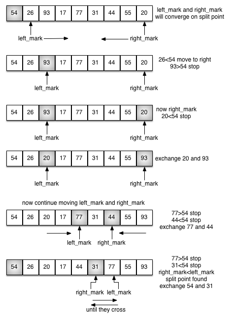

..  Copyright (C)  Brad Miller, David Ranum
    This work is licensed under the Creative Commons Attribution-NonCommercial-ShareAlike 4.0 International License. To view a copy of this license, visit http://creativecommons.org/licenses/by-nc-sa/4.0/.

The Quicksort
~~~~~~~~~~~~~

The **quicksort** uses divide and conquer to gain the same advantages
as the merge sort, while not using additional storage. As a trade-off,
however, it is possible that the list may not be divided in half. When
this happens, we will see that performance is diminished.

A quicksort first selects a value, which is called the **pivot value**.
Although there are many different ways to choose the pivot value, we
will simply use the first item in the list. The role of the pivot value
is to assist with splitting the list. The actual position where the
pivot value belongs in the final sorted list, commonly called the
**split point**, will be used to divide the list for subsequent calls to
the quicksort.

:ref:`Figure 12 <fig_splitvalue>` shows that 54 will serve as our first pivot value.
Since we have looked at this example a few times already, we know that
54 will eventually end up in the position currently holding 31. The
**partition** process will happen next. It will find the split point and
at the same time move other items to the appropriate side of the list,
either less than or greater than the pivot value.

.. _fig_splitvalue:

.. figure:: Figures/firstsplit.png
   :align: center

   Figure 12: The First Pivot Value for a Quicksort

Partitioning begins by locating two position markers—let’s call them
``left_mark`` and ``right_mark``—at the beginning and end of the remaining
items in the list (positions 1 and 8 in :ref:`Figure 13 <fig_partitionA>`). The goal
of the partition process is to move items that are on the wrong side
with respect to the pivot value while also converging on the split
point. :ref:`Figure 13 <fig_partitionA>` shows this process as we locate the position
of 54.

.. _fig_partitionA:

   Figure 13: Finding the Split Point for 54

We begin by incrementing ``left_mark`` until we locate a value that is
greater than the pivot value. We then decrement ``right_mark`` until we
find a value that is less than the pivot value. At this point we have
discovered two items that are out of place with respect to the eventual
split point. For our example, this occurs at 93 and 20. Now we can
exchange these two items and then repeat the process again.

At the point where ``right_mark`` becomes less than ``left_mark``, we
stop. The position of ``right_mark`` is now the split point. The pivot
value can be exchanged with the contents of the split point and the
pivot value is now in place (:ref:`Figure 14 <fig_partitionB>`). In addition, all the
items to the left of the split point are less than the pivot value, and
all the items to the right of the split point are greater than the pivot
value. The list can now be divided at the split point and the quicksort
can be invoked recursively on the two halves.

.. _fig_partitionB:

.. figure:: Figures/partitionB.png
   :align: center

   Figure 14: Completing the Partition Process to Find the Split Point for 54

The ``quick_sort`` function shown in :ref:`ActiveCode 1 <lst_quick>` invokes a recursive
function, ``quick_sort_helper``. ``quick_sort_helper`` begins with the same
base case as the merge sort. If the length of the list is less than or
equal to one, it is already sorted. If it is greater, then it can be
partitioned and recursively sorted. The ``partition`` function
implements the process described earlier.

.. activecode:: lst_quick
    :caption: Quicksort

    def quick_sort(a_list):
        quick_sort_helper(a_list, 0, len(a_list) - 1)

    def quick_sort_helper(a_list, first, last):
        if first < last:
            split = partition(a_list, first, last)
            quick_sort_helper(a_list, first, split - 1)
            quick_sort_helper(a_list, split + 1, last)

    def partition(a_list, first, last):
        pivot_val = a_list[first]
        left_mark = first + 1
        right_mark = last
        done = False

        while not done:
            while left_mark <= right_mark and a_list[left_mark] <= pivot_val:
                left_mark = left_mark + 1
            while left_mark <= right_mark and a_list[right_mark] >= pivot_val:
                right_mark = right_mark - 1
            if right_mark < left_mark:
                done = True
            else:
                a_list[left_mark], a_list[right_mark] = (
                    a_list[right_mark],
                    a_list[left_mark],
                )
        a_list[first], a_list[right_mark] = a_list[right_mark], a_list[first]

        return right_mark

    a_list = [54, 26, 93, 17, 77, 31, 44, 55, 20]
    quick_sort(a_list)
    print(a_list)

.. animation:: quick_anim
   :modelfile: sortmodels.js
   :viewerfile: sortviewers.js
   :model: QuickSortModel
   :viewer: BarViewer

.. For more detail, CodeLens 7 lets you step through the algorithm.
..
.. .. codelens:: quicktrace
..     :caption: Tracing the Quicksort
..
..     def quick_sort(a_list):
..         quick_sort_helper(a_list, 0, len(a_list) - 1)
..     
..     
..     def quick_sort_helper(a_list, first, last):
..         if first < last:
..             split = partition(a_list, first, last)
..             quick_sort_helper(a_list, first, split - 1)
..             quick_sort_helper(a_list, split + 1, last)
..     
..     
..     def partition(a_list, first, last):
..         pivot_val = a_list[first]
..         left_mark = first + 1
..         right_mark = last
..         done = False
..     
..         while not done:
..             while left_mark <= right_mark and a_list[left_mark] <= pivot_val:
..                 left_mark = left_mark + 1
..             while left_mark <= right_mark and a_list[right_mark] >= pivot_val:
..                 right_mark = right_mark - 1
..             if right_mark < left_mark:
..                 done = True
..             else:
..                 a_list[left_mark], a_list[right_mark] = (
..                     a_list[right_mark],
..                     a_list[left_mark],
..                 )
..         a_list[first], a_list[right_mark] = a_list[right_mark], a_list[first]
..     
..         return right_mark
..     
..     
..     a_list = [54, 26, 93, 17, 77, 31, 44, 55, 20]
..     quick_sort(a_list)
..     print(a_list)

To analyze the ``quick_sort`` function, note that for a list of length
:math:`n`, if the partition always occurs in the middle of the list, there
will again be :math:`\log{n}` divisions. In order to find the split
point, each of the :math:`n` items needs to be checked against the pivot
value. The result is :math:`n\log{n}`. In addition, there is no need
for additional memory as in the merge sort process.

Unfortunately, in the worst case, the split points may not be in the
middle and can be very skewed to the left or the right, leaving a very
uneven division. In this case, sorting a list of :math:`n` items divides into
sorting a list of 0 items and a list of :math:`n - 1` items. Then
sorting a list of :math:`n - 1` divides into a list of size 0 and a list
of size :math:`n - 2`, and so on. The result is an :math:`O(n^{2})`
sort with all of the overhead that recursion requires.

We mentioned earlier that there are different ways to choose the pivot
value. In particular, we can attempt to alleviate some of the potential
for an uneven division by using a technique called **median of three**.
To choose the pivot value, we will consider the first, the middle, and
the last element in the list. In our example, those are 54, 77, and 20.
Now pick the median value, in our case 54, and use it for the pivot
value (of course, that was the pivot value we used originally). The idea
is that in the case where the first item in the list does not belong
toward the middle of the list, the median of three will choose a better
“middle” value. This will be particularly useful when the original list
is somewhat sorted to begin with. We leave the implementation of this
pivot value selection as an exercise.

.. admonition:: Self Check

   .. mchoice:: question_sort_7
      :correct: d
      :answer_a: [9, 3, 10, 13, 12]
      :answer_b: [9, 3, 10, 13, 12, 14]
      :answer_c: [9, 3, 10, 13, 12, 14, 17, 16, 15, 19]
      :answer_d: [9, 3, 10, 13, 12, 14, 19, 16, 15, 17]
      :feedback_a: It's important to remember that quicksort works on the entire list and sorts it in place.
      :feedback_b: Remember quicksort works on the entire list and sorts it in place.
      :feedback_c: The first partitioning works on the entire list, and the second partitioning works on the left partition not the right.
      :feedback_d: The first partitioning works on the entire list, and the second partitioning works on the left partition.

      Given the following list of numbers [14, 17, 13, 15, 19, 10, 3, 16, 9, 12] which answer shows the contents of the list after the second partitioning according to the quicksort algorithm?

   .. mchoice:: question_sort_8
       :correct: b
       :answer_a: 1
       :answer_b: 9
       :answer_c: 16
       :answer_d: 19
       :feedback_a: The three numbers used in selecting the pivot are 1, 9, 19.  1 is not the median, and would be a very bad choice for the pivot since it is the smallest number in the list.
       :feedback_b:  Good job.
       :feedback_c: although 16 would be the median of 1, 16, 19 the middle is at len(list) // 2.
       :feedback_d: the three numbers used in selecting the pivot are 1, 9, 19.  9 is the median.  19 would be a bad choice since it is almost the largest.

       Given the following list of numbers [1, 20, 11, 5, 2, 9, 16, 14, 13, 19] what would be the first pivot value using the median of 3 method?

   .. mchoice:: question_sort_9
       :multiple_answers:
       :answer_a: Shell Sort
       :answer_b: Quick Sort
       :answer_c: Merge Sort
       :answer_d: Insertion Sort
       :correct: c
       :feedback_a: Shell sort is about ``n^1.5``
       :feedback_b: Quicksort can be O(n log n), but if the pivot points are not well chosen and the list is just so, it can be O(n^2).
       :feedback_c: Merge Sort is the only guaranteed O(n log n) even in the worst case.  The cost is that merge sort uses more memory.
       :feedback_d: Insertion sort is ``O(n^2)``

       Which of the following sort algorithms are guaranteed to be O(n log n) even in the worst case?
