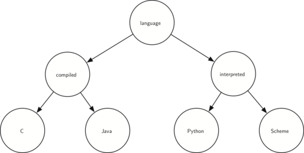

..  Copyright (C)  Brad Miller, David Ranum
    This work is licensed under the Creative Commons Attribution-NonCommercial-ShareAlike 4.0 International License. To view a copy of this license, visit http://creativecommons.org/licenses/by-nc-sa/4.0/.

:skipreading:`True`

Exercises
---------

#. Draw the tree structure resulting from the following set of tree
   function calls:

   ::

       >>> r = BinaryTree(3)
       >>> insert_left(r, 4)
       [3, [4, [], []], []]
       >>> insert_left(r, 5)
       [3, [5, [4, [], []], []], []]
       >>> insert_right(r, 6)
       [3, [5, [4, [], []], []], [6, [], []]]
       >>> insert_right(r, 7)
       [3, [5, [4, [], []], []], [7, [], [6, [], []]]]
       >>> set_root_val(r, 9)
       >>> insert_left(r, 11)
       [9, [11, [5, [4, [], []], []], []], [7, [], [6, [], []]]]
	      

#. Trace the algorithm for creating an expression tree for the
   expression :math:`(4 * 8) / 6 - 3`.

#. Consider the following list of integers: [1, 2, 3, 4, 5, 6, 7, 8, 9, 10]. Show
   the binary search tree resulting from inserting the integers in the
   list.

#. Consider the following list of integers: [10, 9, 8, 7, 6, 5, 4, 3, 2, 1]. Show
   the binary search tree resulting from inserting the integers in the
   list.

#. Generate a random list of integers. Show the binary heap tree
   resulting from inserting the integers on the list one at a time.

#. Using the list from the previous question, show the binary heap tree
   resulting from using the list as a parameter to the ``heapify``
   method. Show both the tree and list form.

#. Draw the binary search tree that results from inserting the following
   keys in the order given: 68, 88, 61, 89, 94, 50, 4, 76, 66, and 82.

#. Generate a random list of integers. Draw the binary search tree
   resulting from inserting the integers on the list.

#. Consider the following list of integers: [1, 2, 3, 4, 5, 6, 7, 8, 9, 10]. Show
   the binary heap resulting from inserting the integers one at a time.

#. Consider the following list of integers: [10, 9, 8, 7, 6, 5, 4, 3, 2, 1]. Show
   the binary heap resulting from inserting the integers one at a time.

#. Consider the two different techniques we used for implementing traversals of a binary
   tree. Why must we check before the call to ``preorder`` when
   implementing it as a method, whereas we could check inside the call when
   implementing it as a function?

#. Show the function calls needed to build the following binary tree.

#. Given the following tree, perform the appropriate rotations to bring it back into balance.
   
   
.. figure:: Figures/rotexer1.png
         :align: center

#. Using the following as a starting point, derive the equation that gives the updated balance factor for node D.
   
.. figure:: Figures/bfderive.png
         :align: center

#. Extend the ``build_parse_tree`` function to handle mathematical
   expressions that do not have spaces between every character.

#. Modify the ``build_parse_tree`` and ``evaluate`` functions to handle
   Boolean statements (``and``, ``or``, and ``not``). Remember that ``not`` is a unary
   operator, so this will complicate your code somewhat.

#. Using the ``find_successor`` method, write a non-recursive inorder
   traversal for a binary search tree.

#. A *threaded* binary tree maintains a reference from each node to
   its successor. Modify the code for a binary search tree to make it threaded, then
   write a non-recursive inorder traversal method for the threaded binary search
   tree.

#. Modify our implementation of the binary search tree so that it
   handles duplicate keys properly. That is, if a key is already in the
   tree then the new payload should replace the old rather than add
   another node with the same key.

#. Create a binary heap with a limited heap size. In other words, the
   heap only keeps track of the :math:`n` most important items. If the heap
   grows in size to more than :math:`n` items the least important item is
   dropped.

#. Clean up the ``print_exp`` function so that it does not include an
   extra set of parentheses around each number.

#. Using the ``heapify`` method, write a sorting function that can
   sort a list in :math:`O(n\log{n})` time.

#. Write a function that takes a parse tree for a mathematical
   expression and calculates the derivative of the expression with
   respect to some variable.

#. Implement a binary heap as a max heap.

#. Using the ``BinaryHeap`` class, implement a new class called
   ``PriorityQueue``. Your ``PriorityQueue`` class should implement the
   constructor plus the ``enqueue`` and ``dequeue`` methods.

#. Implement the ``delete`` method for an AVL tree.

