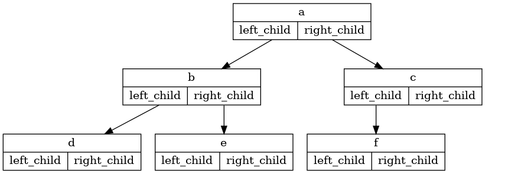

..  Copyright (C)  Brad Miller, David Ranum
    This work is licensed under the Creative Commons Attribution-NonCommercial-ShareAlike 4.0 International License. To view a copy of this license, visit http://creativecommons.org/licenses/by-nc-sa/4.0/.

Nodes and References
~~~~~~~~~~~~~~~~~~~~

Our second method to represent a tree uses nodes and references. In this
case we will define a class that has attributes for the root value as
well as the left and right subtrees. Using nodes and references,
we might think of the tree as being structured like the one shown in :ref:`Figure 2 <fig_treerec>`.
Since this representation more
closely follows the object-oriented programming paradigm, we will
continue to use this representation for the remainder of the chapter.

.. _fig_treerec:

   Figure 2: A Simple Tree Using a Nodes and References Approach

We will start out with a simple class definition for the nodes and
references approach as shown in :ref:`Listing 4 <lst_nar>`. The important thing
to remember about this representation is that the attributes ``left_child``
and ``right_child`` will become references to other instances of the
``BinaryTree`` class. For example, when we insert a new left child into
the tree, we create another instance of ``BinaryTree`` and modify
``self.left_child`` in the root to reference the new tree.

.. _lst_nar:

**Listing 4**

::

    class BinaryTree:
        def __init__(self, root_obj):
            self.key = root_obj
            self.left_child = None
            self.right_child = None
        

Notice that in :ref:`Listing 4 <lst_nar>`, the constructor function expects to
get some kind of object to store in the root. Just as you can store
any object you like in a list, the root object of a tree can be a
reference to any object. For our early examples, we will store the name
of the node as the root value. Using nodes and references to represent
the tree in :ref:`Figure 2 <fig_treerec>`, we would create six instances of the
``BinaryTree`` class.

Next let’s look at the functions we need to build the tree beyond the
root node. To add a left child to the tree, we will create a new binary
tree object and set the ``left_child`` attribute of the root to refer to this
new object. The code for ``insert_left`` is shown in
:ref:`Listing 5 <lst_insl>`.

.. _lst_insl:

**Listing 5**

.. highlight:: python
    :linenothreshold: 5

::

    def insert_left(self, new_node):
        if self.left_child is None:
            self.left_child = BinaryTree(new_node)
        else:
            new_child = BinaryTree(new_node)
            new_child.left_child = self.left_child
            self.left_child = new_child
            
.. highlight:: python
    :linenothreshold: 500

We must consider two cases for insertion. The first case is
characterized by a node with no existing left child. When there is no
left child, simply add a node to the tree. The second case is
characterized by a node with an existing left child. In the second
case, we insert a node and push the existing child down one level in the
tree. The second case is handled by the ``else`` statement on line
4 of :ref:`Listing 5 <lst_insl>`.

The code for ``insert_right`` must consider a symmetric set of cases.
There will either be no right child, or we must insert the node between
the root and an existing right child. The insertion code is shown in
:ref:`Listing 6 <lst_insr>`.

.. _lst_insr:

**Listing 6**

::

    def insert_right(self, new_node):
        if self.right_child == None:
            self.right_child = BinaryTree(new_node)
        else:
            new_child = BinaryTree(new_node)
            new_child.right_child = self.right_child
            self.right_child = new_child

To round out the definition for a simple binary tree data structure, we
will write accessor methods for the left and right children and for
the root values (see :ref:`Listing 7 <lst_naracc>`) .

.. _lst_naracc:

**Listing 7**

::

    def get_root_val(self):
        return self.key

    def set_root_val(self, new_obj):
        self.key = new_obj

    def get_left_child(self):
        return self.left_child

    def get_right_child(self):
        return self.right_child
        

Now that we have all the pieces to create and manipulate a binary tree,
let’s use them to check on the structure a bit more. Let’s make a simple
tree with node a as the root, and add nodes "b" and "c" as children. :ref:`ActiveCode 1 <lst_comptest>` creates the tree and looks at the some of the
values stored in ``key``, ``left_child``, and ``right_child``. Notice that both the
left and right children of the root are themselves distinct instances of
the ``BinaryTree`` class. As we said in our original recursive
definition for a tree, this allows us to treat any child of a binary
tree as a binary tree itself.

.. _lst_comptest:

.. activecode:: bintree
    :caption: Exercising the Node and Reference Implementation

    class BinaryTree:
        def __init__(self, root_obj):
            self.key = root_obj
            self.left_child = None
            self.right_child = None

        def insert_left(self, new_node):
            if self.left_child is None:
                self.left_child = BinaryTree(new_node)
            else:
                new_child = BinaryTree(new_node)
                new_child.left_child = self.left_child
                self.left_child = new_child

        def insert_right(self, new_node):
            if self.right_child == None:
                self.right_child = BinaryTree(new_node)
            else:
                new_child = BinaryTree(new_node)
                new_child.right_child = self.right_child
                self.right_child = new_child

        def get_root_val(self):
            return self.key

        def set_root_val(self, new_obj):
            self.key = new_obj

        def get_left_child(self):
            return self.left_child

        def get_right_child(self):
            return self.right_child             

    a_tree = BinaryTree("a")
    print(a_tree.get_root_val())
    print(a_tree.get_left_child())
    a_tree.insert_left("b")
    print(a_tree.get_left_child())
    print(a_tree.get_left_child().get_root_val())
    a_tree.insert_right("c")
    print(a_tree.get_right_child())
    print(a_tree.get_right_child().get_root_val())
    a_tree.get_right_child().set_root_val("hello")
    print(a_tree.get_right_child().get_root_val())

.. admonition:: Self Check

   .. actex:: mctree_3

      Write a function ``build_tree`` that returns a tree using the nodes and references implementation that looks like this:

      .. image:: Figures/tree_ex.png
      ~~~~
      from test import testEqual
      
      def build_tree():
          pass

      ttree = build_tree()

      testEqual(ttree.get_right_child().get_root_val(), "c")
      testEqual(ttree.get_left_child().get_right_child().get_root_val(), "d")
      testEqual(ttree.get_right_child().get_left_child().get_root_val(), "e")
